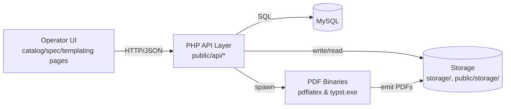
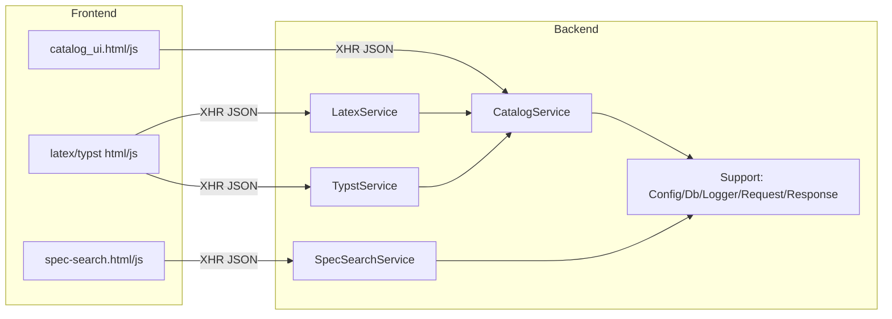
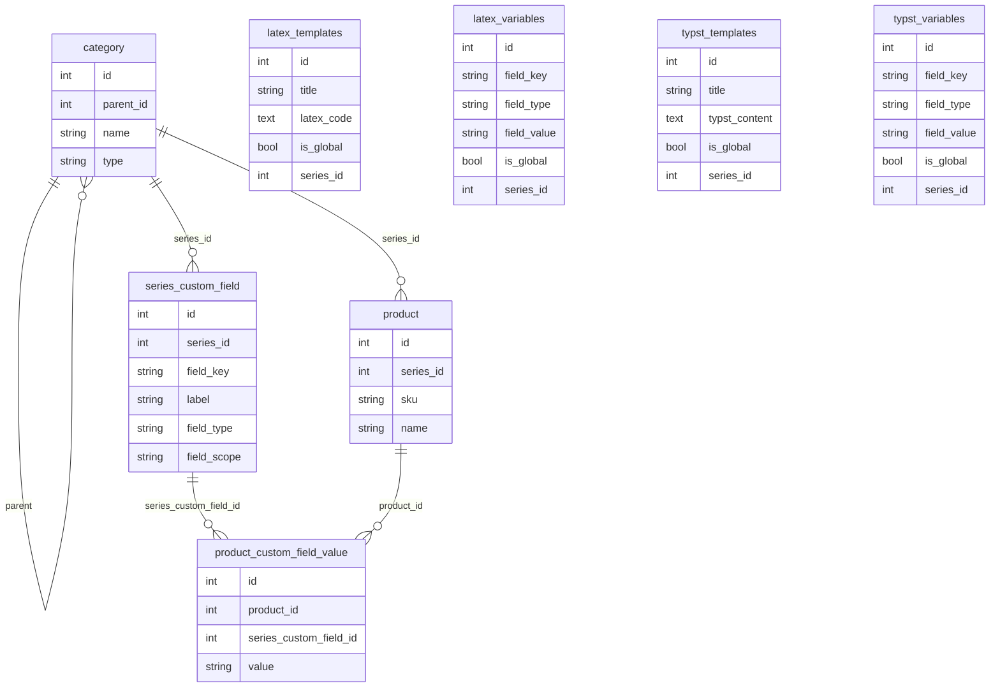
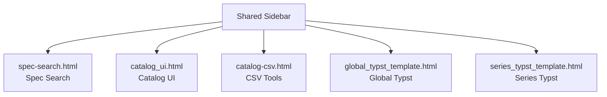
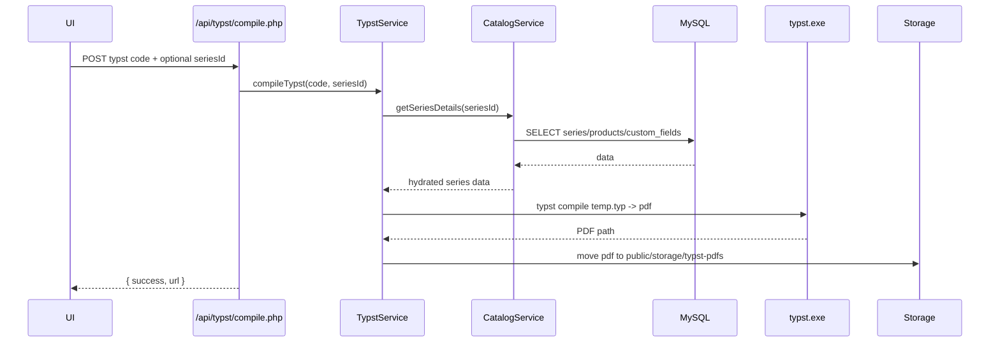
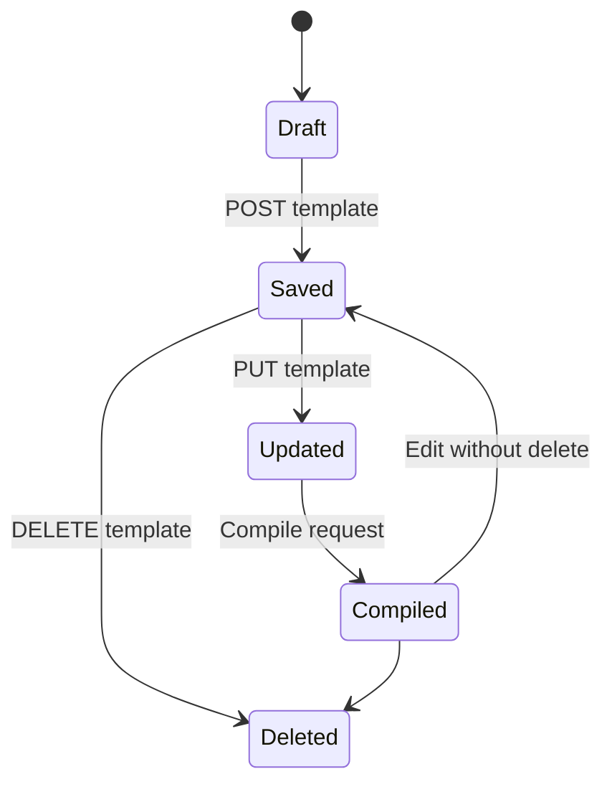
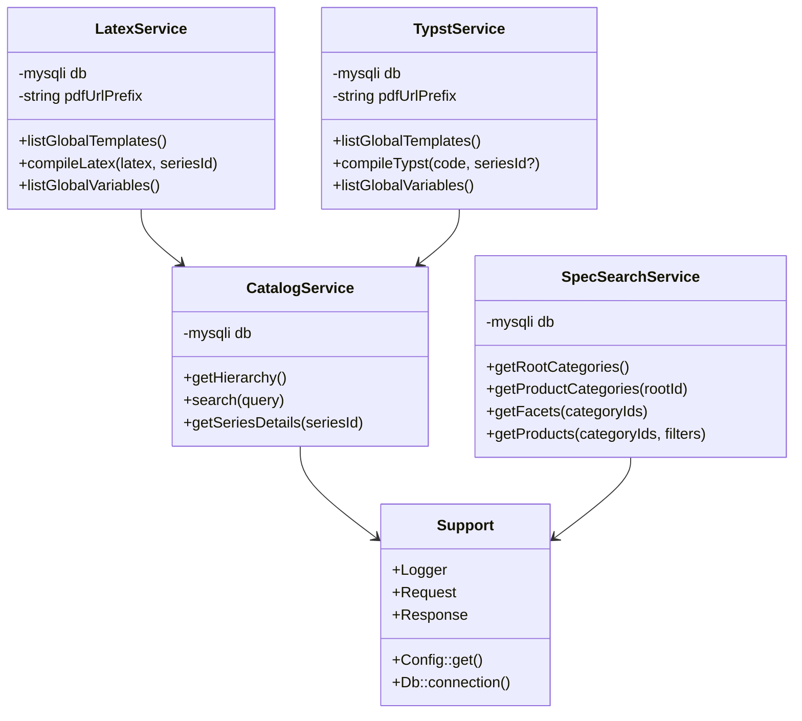

# Repository Specification

## Architecture and Technology Choices
- PHP 8 style procedural endpoints backed by small service classes (`app/*`) for catalog traversal, spec search facets/products, and document templating (LaTeX/Typst); chosen for rapid iteration with minimal framework overhead.
- MySQL (via `mysqli`) as the source of truth for catalog hierarchies, products, custom fields, templates, and variables; simple SQL over ORM to keep performance predictable.
- Static HTML/JS in `public` and `assets` for operator-facing tools; communicates with JSON APIs under `public/api`.
- PDF generation uses external binaries (`pdflatex`, `bin/typst.exe` fallback to PATH) writing to `public/storage/*`; logging goes to `storage/logs/app.log` with correlation IDs.
- Constraints: Windows-first PowerShell workflows; no Composer/runtime dependency manager present; file-based autoload via `app/bootstrap.php`.

## System Context


## Container / Deployment Overview
```mermaid
graph TD
    subgraph Host (Windows/Laragon)
        nginx[Web Server] --> phpFpm[PHP Runtime]
        phpFpm --> apiLayer[public/api endpoints]
        apiLayer --> services[App Services]
        services --> mysql[MySQL]
        services --> pdfBin[pdflatex/typst.exe]
        services --> storage[(storage & public/storage)]
    end
```

## Module Relationship (Backend / Frontend)


## Data Model
- Core tables: `category` (tree of categories/series), `product` (linked to series), `series_custom_field` (field metadata, scope series/product attributes), `product_custom_field_value`, `latex_templates`/`latex_variables`, `typst_templates`/`typst_variables`.
- Files: generated PDFs in `public/storage/latex-pdfs` and `public/storage/typst-pdfs`; CSV imports in `storage/csv`.

### ER Diagram


## Key Processes
- Catalog hierarchy/search: build tree from `category`, attach products; search by name/SKU.
- Spec search: root/product category discovery, facet construction from custom fields, filtered product list.
- Template compilation: fetch series metadata + products, substitute into LaTeX/Typst, compile via external binary, expose PDF URL; Typst data header sanitizes associative keys to Typst-safe identifiers (non-alphanumeric replaced with `_`, leading digits prefixed) and deduplicates collisions to prevent invalid variable names.
- Operator navigation: a shared sidebar on each operator UI exposes Spec Search, Catalog UI, CSV tools, Global Typst Template, and Series Typst Template to avoid broken links (deprecated Global LaTeX link removed).

### Operator UI Navigation Map


### Sequence (Typst Compile)


### Flowchart (Spec Search Filtering)
```mermaid
flowchart TD
    A[Receive categoryIds + filters] --> B{categoryIds empty?}
    B -- Yes --> C[Return []]
    B -- No --> D[Fetch products + series]
    D --> E{Series filter present?}
    E -- Yes --> F[Apply IN clause on series names]
    E -- No --> G[Skip]
    F --> H
    G --> H
    H{Attribute filters?} -->|Yes| I[Add EXISTS per field_key/value]
    H -->|No| J[Use base query]
    I --> K[Limit 500, execute]
    J --> K
    K --> L[Hydrate custom field values]
    L --> M[Return product list]
```

### State Diagram (Template Lifecycle)


### Class Diagram (Key Backend Classes)


### Pseudocode (Critical Paths)
```text
Catalog.search(query):
  if query empty -> return []
  search categories name LIKE %query%
  search products name/SKU LIKE %query%
  map ids/parents/type into flat list

SpecSearch.getProducts(categoryIds, filters):
  build base JOIN query for products under series in categoryIds
  apply series name IN filter when provided
  for each attribute filter: add EXISTS against product_custom_field_value + series_custom_field
  LIMIT 500, run query, collect product ids
  hydrate attributes for those ids and merge into product rows

TypstService.compileTypst(code, seriesId?):
  header = generateDataHeader(seriesId)
    - inject globals, series metadata, and products
    - sanitize Typst keys (strip invalid chars, prefix leading digits, dedupe clashes)
  write header + code to temp .typ file
  call typst.exe compile input output
  on success move PDF to public/storage/typst-pdfs, return URL/path; else throw RuntimeException
```

## Key Processes (continued) and Constraints
- CSV lifecycle: imports stored under `storage/csv`, catalog truncation locked via `config/app.php` token/lock key.
- Logging: `App\Support\Logger` writes JSON lines to `storage/logs/app.log` with correlation ID per request.
- Security baseline: validate/escape SQL inputs, forbid logging secrets/PII, generated PDFs publicly accessible under `public/storage`.
- Editor UX: Typst/LaTeX template editors wrap `textarea#latexSource` with a line-numbered view (monospace, synchronized scroll) to simplify debugging and support copy/paste without losing positioning.
- Saved Typst templates: table-level “PDF Download” triggers a fresh compile when no stored `downloadUrl` exists, then opens the generated PDF URL.
