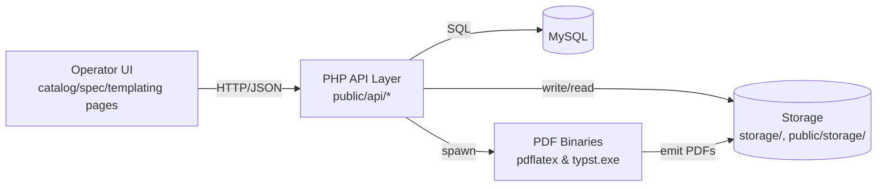
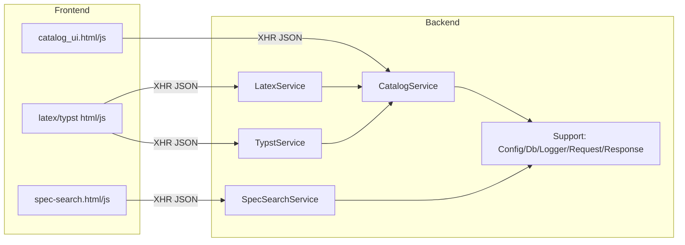
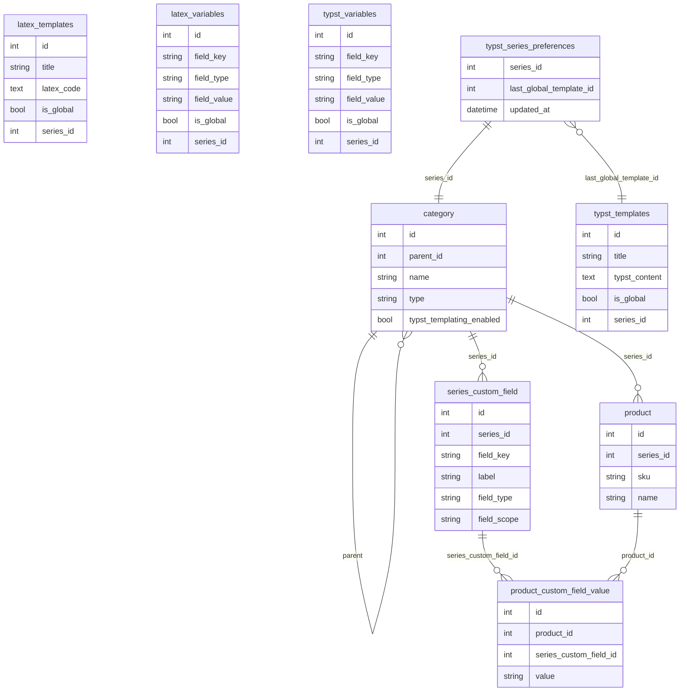
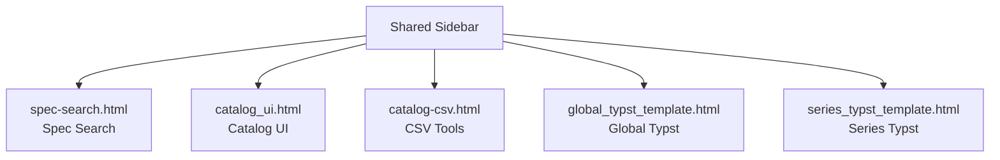
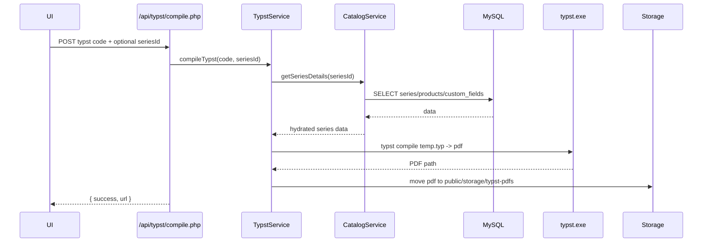
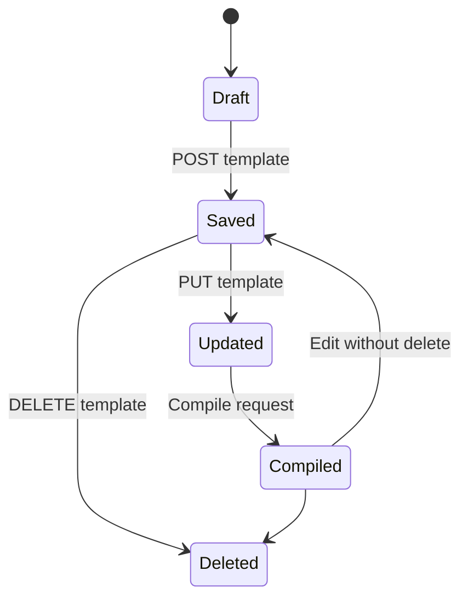
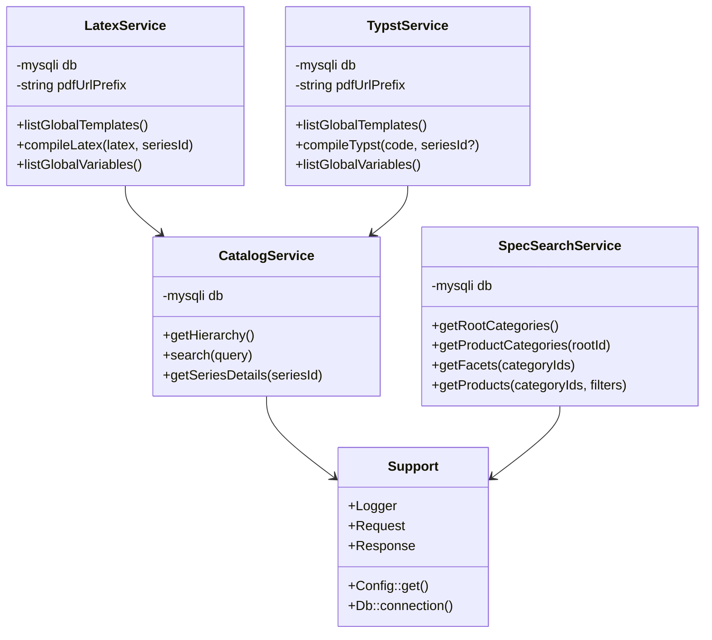

# Repository Specification

## Architecture and Technology Choices
- PHP 8 style procedural endpoints backed by small service classes (`app/*`) for catalog traversal, spec search facets/products, and document templating (LaTeX/Typst); chosen for rapid iteration with minimal framework overhead.
- MySQL (via `mysqli`) as the source of truth for catalog hierarchies, products, custom fields, templates, and variables; simple SQL over ORM to keep performance predictable.
- Static HTML/JS in `public` and `assets` for operator-facing tools; communicates with JSON APIs under `public/api`.
- PDF generation uses external binaries (`pdflatex`, `bin/typst.exe` fallback to PATH) writing to `public/storage/*`; logging goes to `storage/logs/app.log` with correlation IDs.
- Constraints: Windows-first PowerShell workflows; no Composer/runtime dependency manager present; file-based autoload via `app/bootstrap.php`.

## System Context


## Container / Deployment Overview
```mermaid
graph TD
    subgraph Host (Windows/Laragon)
        nginx[Web Server] --> phpFpm[PHP Runtime]
        phpFpm --> apiLayer[public/api endpoints]
        apiLayer --> services[App Services]
        services --> mysql[MySQL]
        services --> pdfBin[pdflatex/typst.exe]
        services --> storage[(storage & public/storage)]
    end
```

## Module Relationship (Backend / Frontend)


## Data Model
- Core tables: `category` (tree of categories/series), `product` (linked to series), `series_custom_field` (field metadata, scope series/product attributes), `product_custom_field_value`, `latex_templates`/`latex_variables`, `typst_templates`/`typst_variables`, `typst_series_preferences` (per-series Typst UI settings such as the last imported global template id).
- Series-level Typst toggle: `category.typst_templating_enabled` (TINYINT(1) default 0, migrated from legacy `latex_templating_enabled` when present) remembers whether the Catalog UI “Enable Typst Templating” switch was turned on for that series so the UI can surface the Typst template link without re-toggling.
- Template audit fields: `typst_templates.last_pdf_path` and `typst_templates.last_pdf_generated_at` hold the most recent compiled PDF location/timestamp for both global and series templates to drive Save PDF/Download actions without recompile.
- Files: generated PDFs in `public/storage/latex-pdfs` and `public/storage/typst-pdfs`; CSV imports in `storage/csv`.

### ER Diagram


## Key Processes
- Catalog hierarchy/search: build tree from `category`, attach products; search by name/SKU.
- Spec search: root/product category discovery, facet construction from custom fields, filtered product list.
- Template compilation: fetch series metadata + products, substitute into LaTeX/Typst, compile via external binary, expose PDF URL; Typst data header sanitizes associative keys to Typst-safe identifiers (non-alphanumeric replaced with `_`, leading digits prefixed) and deduplicates collisions to prevent invalid variable names.
- Global Typst variable palette: the Variables List renders each global key as a badge that inserts `{{typst_safe_key}}` at the caret in the editor; compile replaces these placeholders with the stored `globals` values (with asset paths staged into the Typst build dir).
- Series Typst variable palette: metadata badges insert `{{key}}` placeholders, and product attribute badges are grouped under a parent `products` wrapper; clicking the wrapper inserts a products loop scaffold, while individual custom-field badges insert `product.attributes.<key>` tokens (plus `product.sku` and `product.name` badges). Compile still replaces `{{key}}` placeholders for convenience and exposes the full `data` object (including `products`) for loop-based Typst code.
- Operator navigation: a shared sidebar on each operator UI exposes Spec Search, Catalog UI, CSV tools, Global Typst Template, and Series Typst Template to avoid broken links (deprecated Global LaTeX link removed).
- Template persistence: Typst templates track `last_pdf_path` and `last_pdf_generated_at` so Save PDF / Save & Compile flows can persist the most recent compiled artifact for series/global templates and enable download buttons without re-compiling.
- Series Typst import preference: when an operator imports a global template on the series page, the selected global template id is stored in `typst_series_preferences` keyed by `series_id`; on page load, the UI pre-selects the stored global template if it still exists, otherwise it falls back to the placeholder without auto-importing.
- Global Typst assets: file/image variables upload their binary payloads to `public/storage/typst-assets/` with unique, sanitized filenames (value stored as `typst-assets/<name>`). UI previews use the stored URL or data URI, and TypstService stages those assets into the build directory so `#image("{{key}}")` resolves to the actual file instead of a missing placeholder.
- Catalog Typst templating toggle: toggling “Enable Typst Templating” on a series writes `category.typst_templating_enabled = 1` for that series (and syncs forward from legacy `latex_templating_enabled` if present); hierarchy/series selection reads the flag to pre-check the switch and show the Typst template link without re-toggling.

### Operator UI Navigation Map


### Sequence (Typst Compile)


### Flowchart (Spec Search Filtering)
```mermaid
flowchart TD
    A[Receive categoryIds + filters] --> B{categoryIds empty?}
    B -- Yes --> C[Return []]
    B -- No --> D[Fetch products + series]
    D --> E{Series filter present?}
    E -- Yes --> F[Apply IN clause on series names]
    E -- No --> G[Skip]
    F --> H
    G --> H
    H{Attribute filters?} -->|Yes| I[Add EXISTS per field_key/value]
    H -->|No| J[Use base query]
    I --> K[Limit 500, execute]
    J --> K
    K --> L[Hydrate custom field values]
    L --> M[Return product list]
```

### State Diagram (Template Lifecycle)


### Class Diagram (Key Backend Classes)


### Pseudocode (Critical Paths)
```text
Catalog.search(query):
  if query empty -> return []
  search categories name LIKE %query%
  search products name/SKU LIKE %query%
  map ids/parents/type into flat list

SpecSearch.getProducts(categoryIds, filters):
  build base JOIN query for products under series in categoryIds
  apply series name IN filter when provided
  for each attribute filter: add EXISTS against product_custom_field_value + series_custom_field
  LIMIT 500, run query, collect product ids
  hydrate attributes for those ids and merge into product rows

TypstService.compileTypst(code, seriesId?):
  header = generateDataHeader(seriesId)
    - inject globals, series metadata, and products
    - sanitize Typst keys (strip invalid chars, prefix leading digits, dedupe clashes)
    - build placeholder map for {{typst_safe_key}} badges from globals/metadata/first product attrs
  write header + code to temp .typ file
  call typst.exe compile input output
  on success move PDF to public/storage/typst-pdfs, return URL/path; else throw RuntimeException
```

### Decisions / Q&A
- 2025-12-03: Save PDF on `series_typst_template.html` (and Save & Compile) must compile Typst and persist `last_pdf_path` + `last_pdf_generated_at` on the corresponding `typst_templates` row so operators can download the stored artifact without re-compiling.
- 2025-12-03: Confirmed with developer that Series Typst metadata badges should show only the Typst-safe key and insert the corresponding `{{key}}` token into the editor so compiled PDFs pull actual series values even when original keys contain dots/spaces (compile replaces placeholders and keeps the structured `data` object available).
- 2025-12-03: Series Typst custom fields are displayed inside a `products` wrapper badge that inserts a loop scaffold; field badges inside the wrapper insert `product.attributes.<key>` tokens to encourage iterating product rows while keeping compilation compatible.
- 2025-12-04: Global Typst Variables List must render keys as clickable badges; clicking inserts the Typst-safe `{{key}}` placeholder at the current caret, and compile must resolve the badge token to the stored global value (including staged asset paths) so PDF output reflects the latest globals.
- 2025-12-05: Global Typst file/image variables must upload and persist the binary asset under `public/storage/typst-assets/` (value saved as `typst-assets/<filename>`), display a thumbnail in the Variables List, and ensure Typst compile uses the uploaded asset path (staged into the build directory) instead of an empty placeholder.
- 2025-12-07: The Series Typst page must remember the last imported global template per series server-side; preferences live in `typst_series_preferences`, and the UI pre-selects the stored global template only when it still exists (otherwise the dropdown defaults to the placeholder without auto-importing).
- 2025-12-04: Catalog UI “Enable Typst Templating” switch must persist per series via `category.typst_templating_enabled` (migrated from `latex_templating_enabled` when present); hierarchy payloads should surface the stored flag so operators see prior enablement without re-clicking the toggle.

## Key Processes (continued) and Constraints
- CSV lifecycle: imports stored under `storage/csv`, catalog truncation locked via `config/app.php` token/lock key.
- Logging: `App\Support\Logger` writes JSON lines to `storage/logs/app.log` with correlation ID per request.
- Security baseline: validate/escape SQL inputs, forbid logging secrets/PII, generated PDFs publicly accessible under `public/storage`.
- Editor UX: Typst/LaTeX template editors wrap `textarea#latexSource` with a line-numbered view (monospace, synchronized scroll) to simplify debugging and support copy/paste without losing positioning; the Series Typst page also exposes clickable badges that paste Typst-safe keys into the editor for rapid variable insertion. Global Typst variables render in a Bootstrap 5 DataTable (Field Key / Field Type / Field Data + Actions); the Field Key cell is a badge that inserts `{{typst_safe_key}}` at the caret, while an Edit button opens the Variable Setup form without inserting anything, and an Add button clears the form for creating a new variable. File/Image variables show a thumbnail preview in the Field Data column, resolving stored paths under `public/` or `public/storage/` (and falling back to a data URI when only a physical path is available).
- Saved Typst templates: table-level ΓÇ£PDF DownloadΓÇ¥ triggers a fresh compile when no stored `downloadUrl` exists, then opens the generated PDF URL.
