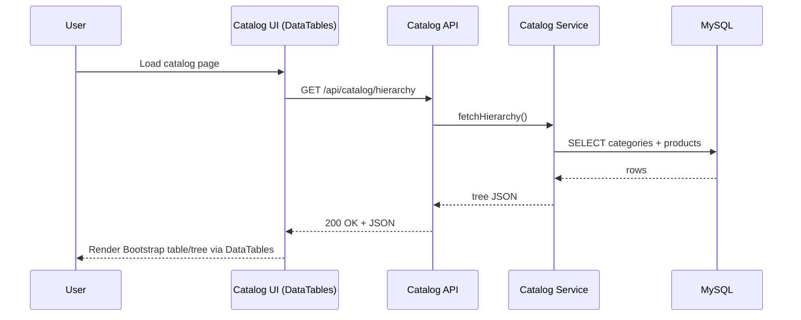
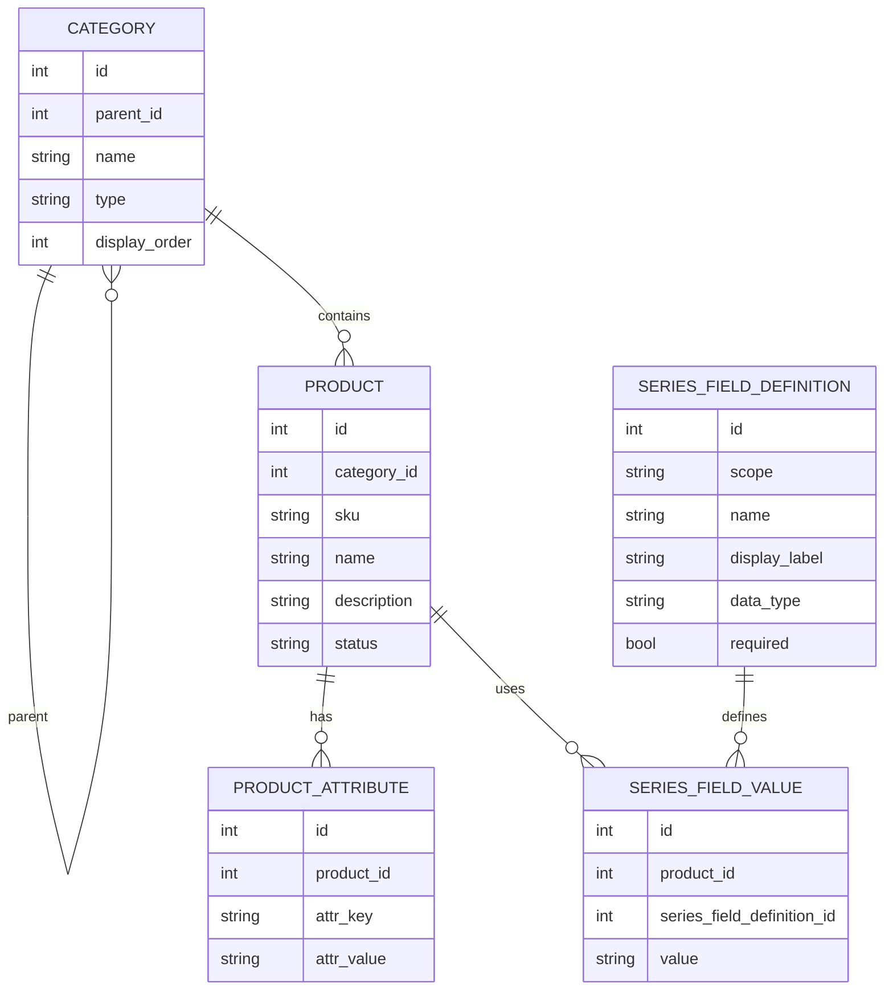
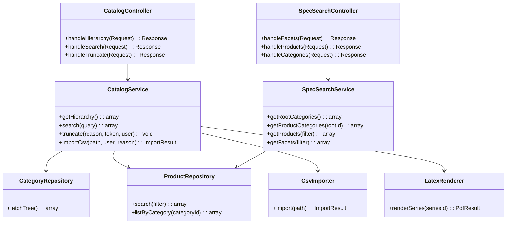
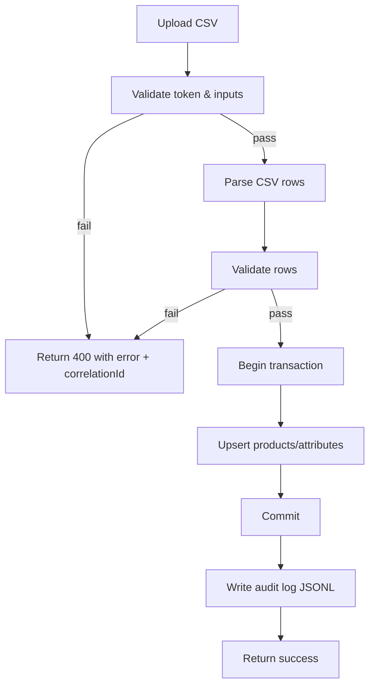
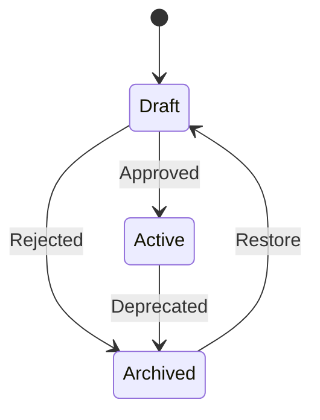

Catalog & Spec Search Refactor Specification
=============================================

Goals
-----
- Reorganize the codebase into clear front-end and back-end boundaries while keeping PHP fully object-oriented (no Composer/PSR-4).
- Adopt Bootstrap 5 and DataTables for UI tables; encapsulate jQuery usage inside ES6 classes to avoid global procedural code.
- Preserve existing CSV/LaTeX flows but wrap them in service classes with explicit error handling and logging (with correlation IDs).

1. Architecture and Technology Choices
--------------------------------------
- **Server**: PHP (OO), manual autoload/require with a small bootstrap; thin public controllers that delegate to services.
- **UI**: Bootstrap 5 for layout, DataTables for tabular interactions; jQuery used via ES6 class wrappers for DOM/events.
- **Data**: MySQL for catalog and search data; local storage for CSV imports and LaTeX build/PDF outputs.
- **Error handling**: Centralized exception type for API errors; structured JSON `{ error: { code, message, correlationId } }`.
- **Logging**: Service-boundary logging with correlation IDs; no secrets/PII.
- **Configuration**: Centralized in `config/app.php` and `config/db.php`; avoid magic values (tokens, paths, limits).
- **Testing**: Unit (services/validators), integration (DB + endpoints), contract (API response shape), optional E2E (critical flows).

2. Data Model
-------------
- `category`: `id`, `parent_id`, `name`, `type` (series/root/leaf), `display_order`.
- `product`: `id`, `category_id`, `sku`, `name`, `description`, `status` (draft/active/archived), `created_at`, `updated_at`.
- `product_attribute`: `id`, `product_id`, `attr_key`, `attr_value`.
- `series_field_definition`: `id`, `scope` (series_metadata/product_attribute), `name`, `display_label`, `data_type`, `required`.
- `truncate_audit` (JSONL file): `timestamp`, `correlation_id`, `reason`, `user`, `token`.
- `csv import artifacts`: stored under `storage/csv/*` with import timestamps.
- `latex outputs`: build inputs in `storage/latex-build/`, PDFs in `storage/latex-pdfs/`.

3. Key Processes
----------------
- Catalog hierarchy fetch for UI tree (categories with nested products).
- Faceted/spec search (root categories, product categories, products, facets).
- CSV import for products and series metadata with validation and audit trail.
- LaTeX PDF generation for catalog/series outputs.
- Catalog truncate with confirmation token and audit logging.

4. Pseudocode (Critical Paths)
------------------------------
**API Request Handling**
```
onRequest(request):
  correlationId = generateId()
  try:
    route = matchRoute(request.path)
    result = route.handler(request, correlationId)
    return json(200, result, correlationId)
  catch CatalogApiException ex:
    logError(ex, correlationId)
    return json(ex.status, { error: { code: ex.code, message: ex.message, correlationId } })
  catch Throwable ex:
    logError(ex, correlationId)
    return json(500, { error: { code: "internal_error", message: "Unexpected error", correlationId } })
```

**CSV Import Flow**
```
importProducts(csvPath, user, reason):
  assertToken(request.token, CATALOG_TRUNCATE_CONFIRM_TOKEN)
  rows = csvReader(csvPath)
  validated = []
  for row in rows:
    validated.append(validateRow(row))
  db.begin()
    upsertProducts(validated)
    logAudit("import", user, reason, correlationId)
  db.commit()
  return { imported: count(validated) }
```

5. System Context Diagram (Mermaid)
-----------------------------------
```mermaid
graph TD
  User[Browser (Bootstrap 5 + DataTables + jQuery ES6 classes)] -->|HTTPS| WebApp[PHP Web App]
  WebApp -->|AJAX JSON| CatalogAPI[Catalog API]
  WebApp -->|AJAX JSON| SpecSearchAPI[Spec-Search API]
  CatalogAPI --> DB[(MySQL)]
  SpecSearchAPI --> DB
  CatalogAPI --> Files[(Storage: csv, latex-build, latex-pdfs)]
  CatalogAPI --> PDFGen[LaTeX Engine]
```

6. Container/Deployment Overview (Mermaid)
------------------------------------------
```mermaid
graph TB
  Browser[Browser] --> WebServer[Web Server + PHP runtime]
  WebServer --> Public[public/ (controllers + static assets)]
  Public --> AppLayer[app/ domain services]
  AppLayer --> Config[config/]
  AppLayer --> DB[(MySQL)]
  AppLayer --> Storage[(storage/ csv, latex-build, latex-pdfs)]
```

7. Module Relationship Diagram (Backend / Frontend) (Mermaid)
-------------------------------------------------------------
```mermaid
graph LR
  Frontend[Frontend Pages\n(Bootstrap 5, DataTables, jQuery ES6 classes)] -->|AJAX| ApiControllers
  ApiControllers[Public Controllers] --> CatalogSvc[Catalog Service]
  ApiControllers --> SearchSvc[SpecSearch Service]
  CatalogSvc --> CatRepo[Category Repository]
  CatalogSvc --> ProdRepo[Product Repository]
  CatalogSvc --> SeriesRepo[Series Field Repo]
  CatalogSvc --> CsvImporter[CSV Importer]
  CatalogSvc --> PdfMaker[LaTeX Renderer]
  SearchSvc --> SearchRepo[Search Repository]
  ApiControllers --> Logger[Logger w/ Correlation IDs]
```

8. Sequence Diagram (Mermaid)
-----------------------------


9. ER Diagram (Mermaid)
-----------------------


10. Class Diagram (Mermaid)
---------------------------


11. Flowchart (Mermaid) - CSV Import
------------------------------------


12. State Diagram (Mermaid) - Product
-------------------------------------


Testing Approach
----------------
- **Unit**: service methods (validation, tree assembly, CSV parsing), utility functions.
- **Integration**: endpoint calls hitting MySQL with seeded data; verify JSON shapes expected by DataTables.
- **Contract**: error envelope shape `{ error: { code, message, correlationId } }` and success envelopes consumed by UI.
- **Optional E2E**: load catalog UI, ensure DataTables renders and paginates via real APIs.

Non-Functional & Constraints
----------------------------
- Keep bootstrap/jQuery/DataTables assets under `public/assets/`; bundle/copy via PowerShell.
- Avoid global jQuery usage; define ES6 classes per page (e.g., `class CatalogTable` that binds events and DataTables init).
- Local storage writable under `storage/*`; do not serve private CSV files publicly.
- Ensure LaTeX binary path is configurable via env/`config/app.php` (default `pdflatex`).
