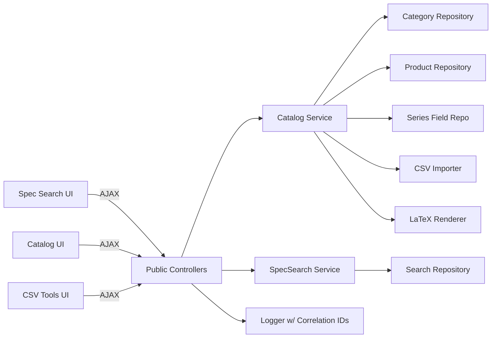
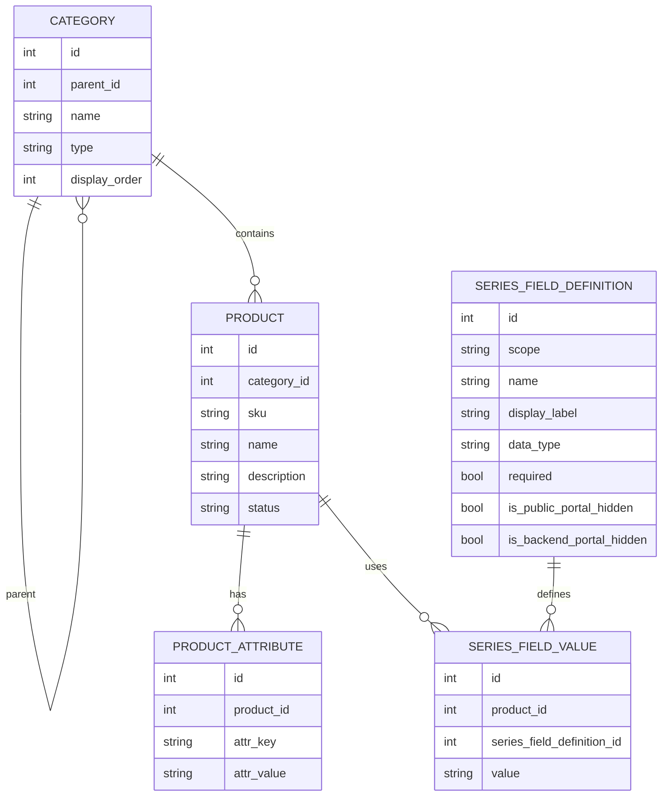
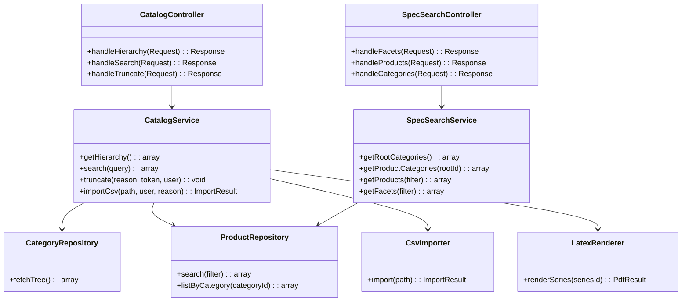
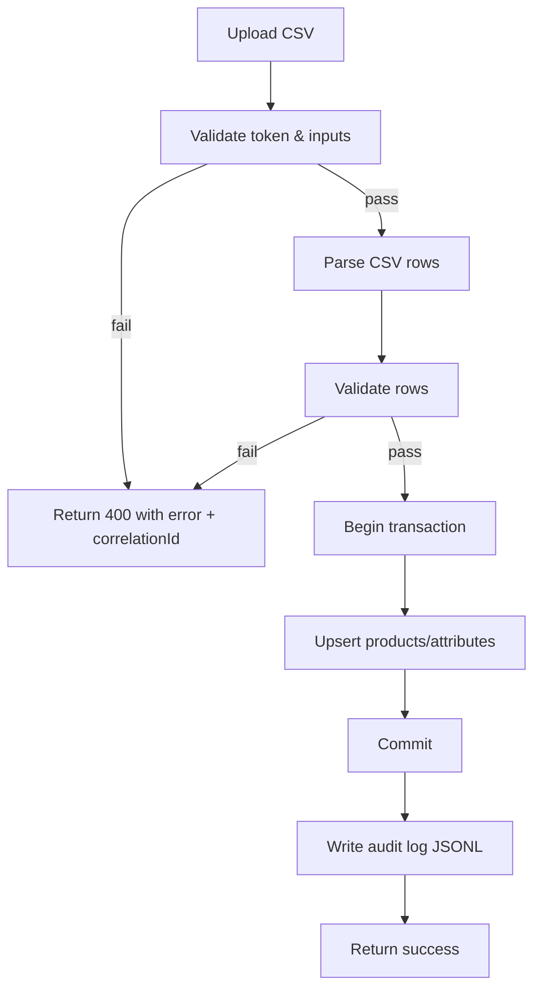
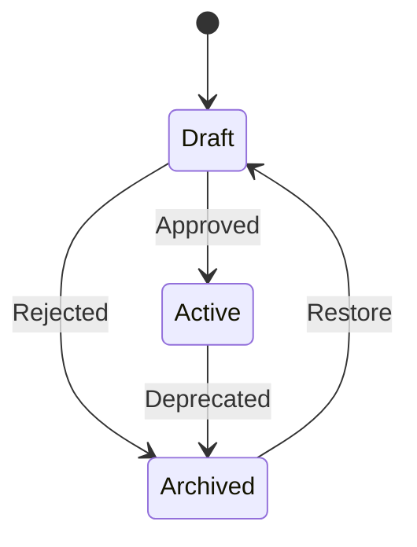

Catalog & Spec Search Refactor Specification
=============================================

Goals
-----
- Reorganize the codebase into clear front-end and back-end boundaries while keeping PHP fully object-oriented (no Composer/PSR-4).
- Adopt Bootstrap 5 and DataTables for UI tables; encapsulate jQuery usage inside ES6 classes to avoid global procedural code.
- Preserve existing CSV/LaTeX flows but wrap them in service classes with explicit error handling and logging (with correlation IDs).
- Move CSV import/export + truncate tooling into a dedicated CSV management page while keeping API behavior unchanged.

1. Architecture and Technology Choices
--------------------------------------
- **Server**: PHP (OO), manual autoload/require with a small bootstrap; thin public controllers that delegate to services.
- **UI**: Bootstrap 5 for layout, DataTables for tabular interactions; jQuery used via ES6 class wrappers for DOM/events.
- **Styling**: Global Meyer reset (v2) loaded before Bootstrap to normalize spacing; sidebar brand is text-only (no icon), collapse control uses icon-only trigger; sidebar/grid rows use zero gutters with body padding removed (main content handles its own spacing) to prevent white rails; sidebar is sticky from top to bottom (100vh) on desktop with mobile slide-over behavior.
- **Data**: MySQL for catalog and search data; local storage for CSV imports, LaTeX build/PDF outputs, and media uploads under `storage/media/...`.
- **Error handling**: Centralized exception type for API errors; structured JSON `{ error: { code, message, correlationId } }`.
- **Logging**: Service-boundary logging with correlation IDs; no secrets/PII.
- **Configuration**: Centralized in `config/app.php` and `config/db.php`; avoid magic values (tokens, paths, limits).
- **Testing**: Unit (services/validators), integration (DB + endpoints), contract (API response shape), optional E2E (critical flows).

2. Data Model
-------------
- `category`: `id`, `parent_id`, `name`, `type` (series/root/leaf), `display_order`.
- `product`: `id`, `category_id`, `sku`, `name`, `description`, `status` (draft/active/archived), `created_at`, `updated_at`.
- `product_attribute`: `id`, `product_id`, `attr_key`, `attr_value`.
- `series_custom_field`: `id`, `series_id`, `field_key`, `label`, `field_type` (`text` | `number` | `file`), `field_scope` (`series_metadata` | `product_attribute`), `default_value`, `sort_order`, `is_required`, `is_public_portal_hidden`, `is_backend_portal_hidden`.
- `product_custom_field_value`: `id`, `product_id`, `series_custom_field_id`, `value` (text; file fields store media token/path).
- `series_custom_field_value`: `id`, `series_id`, `series_custom_field_id`, `value` (text; file fields store media token/path).
- `series_field_definition`: `id`, `scope` (series_metadata/product_attribute), `name`, `display_label`, `data_type`, `required`.
- `truncate_audit` (JSONL file): `timestamp`, `correlation_id`, `reason`, `user`, `token`.
- `csv import artifacts`: stored under `storage/csv/*` with import timestamps.
- `latex outputs`: build inputs in `storage/latex-build/`, PDFs in `storage/latex-pdfs/`.
- `media files`: stored under `storage/media/<category>/<series>/<field-key>/<entity-id>/<original-filename>`; single file per field; original filename preserved with replace/clear semantics.

3. Key Processes
----------------
- Catalog hierarchy fetch for UI tree (categories with nested products).
- Catalog hierarchy CRUD preserves parent/child integrity: series nodes must always carry a `parentId` on create/update, parent must be a category, and the UI resubmits the stored parent on edit to avoid orphaned series validation errors.
- Display order edits keep sibling ordering: UI always sends `displayOrder` with updates (falling back to the current value if the input is blank) so backend ordering persists after node edits.
- Faceted/spec search (root categories, product categories, products, facets).
- Spec-search edit handoff to Catalog UI via query params (category/series/product) to pre-fill the series tree and search field.
- CSV import for products and series metadata with validation and audit trail.
- CSV import/export/truncate history management in a dedicated CSV page (`catalog-csv.html`) with download/restore/delete actions.
- LaTeX PDF generation for catalog/series outputs.
- Custom field management: series custom field definitions support selectable types (text, number, file) for product attributes and series metadata; file uploads are validated (image/pdf/glb) and stored under `storage/media/...` using category/series folders; replacing or clearing updates storage and persisted value. Each field now tracks `Public Portal Hidden` and `Backend Portal Hidden` flags (stored as booleans) alongside `Required` to control downstream portal visibility while keeping catalog editor visibility unchanged.
- Product table resiliency: when series custom fields are added or deleted, the product DataTable must be rebuilt after clearing any previously rendered rows so the updated column set (base + dynamic custom fields + actions) matches the header and avoids DataTables “incorrect column count” warnings during reinitialization.
- Global loading affordance: Catalog UI, CSV, and LaTeX pages display a top progress bar plus a light white/grey overlay that blocks pointer/keyboard interactions (including scroll) until tracked requests finish; the Spec Search page stays fully interactive with no overlay or progress bar.
- Catalog UI status feedback is scoped per section: hierarchy/product catalog manager actions surface messages in a localized banner, while series custom fields, series metadata, and products each render their own inline status message container to avoid cross-section confusion.
- Catalog truncate with confirmation token and audit logging.
- Sidebar navigation panel linking Catalog UI, Spec Search, and LaTeX templating pages; AdminLTE-like persistent left rail on desktop with slide-over toggle on mobile.

4. Pseudocode (Critical Paths)
------------------------------
**API Request Handling**
```
onRequest(request):
  correlationId = generateId()
  try:
    route = matchRoute(request.path)
    result = route.handler(request, correlationId)
    return json(200, result, correlationId)
  catch CatalogApiException ex:
    logError(ex, correlationId)
    return json(ex.status, { error: { code: ex.code, message: ex.message, correlationId } })
  catch Throwable ex:
    logError(ex, correlationId)
    return json(500, { error: { code: "internal_error", message: "Unexpected error", correlationId } })
```

**CSV Import Flow**
```
importProducts(csvPath, user, reason):
  assertToken(request.token, CATALOG_TRUNCATE_CONFIRM_TOKEN)
  rows = csvReader(csvPath)
  validated = []
  for row in rows:
    validated.append(validateRow(row))
  db.begin()
    upsertProducts(validated)
    logAudit("import", user, reason, correlationId)
  db.commit()
  return { imported: count(validated) }
```

**Sidebar Navigation Panel**
```
initSidebarNav(currentPage):
  navItems = [
    { id: "spec", label: "Spec Search", href: "spec-search.html" },
    { id: "catalog", label: "Catalog UI", href: "catalog_ui.html" },
    { id: "csv", label: "CSV Import/Export", href: "catalog-csv.html" },
    { id: "latex", label: "LaTeX Templating", href: "latex-templating.html" }
  ]
  render AdminLTE-like left rail with Bootstrap 5 classes
  mark item as active when href matches currentPage
  if viewport < md:
    slide sidebar in/out via toggle button and backdrop
  else:
    keep sidebar sticky while main content scrolls
    collapse class shrinks rail to 80px (icons only) and main content expands without extra gutter
```

**Spec Search Edit → Catalog Prefill**
```
onSpecSearchEditClick(record):
  url = buildUrl("catalog_ui.html", {
    category: record.category,
    series: record.series,
    product: record.sku
  })
  redirect(url)

onCatalogLoad():
  params = parseQuery()
  if params.product:
    setInputValue("#hierarchy-search", params.product)
    triggerSearch(params.product)
    setPendingProductFilter(params.product) // forward to DataTables search once products load
  if params.series:
    match = findSeriesNodeByName(params.series, parentName=params.category)
    if match:
      expandAncestors(match.id)
      selectNode(match.id)
      loadSeriesContext(match.id)
  if pendingProductFilter and product DataTable exists:
    applyDataTableSearch("#product-list-table", pendingProductFilter)
```

**Custom Field Save (text/number/file)**
```
saveCustomFieldValue(entityType, entityId, fieldDef, input):
  if fieldDef.field_type == 'number':
    assert is_numeric(input.value)
    normalized = trim(input.value) // stored as text but validated numeric
  else if fieldDef.field_type == 'file':
    assert input.file exists
    assert mime in ['image/*', 'application/pdf', 'model/gltf-binary']
    assert input.file.size <= MEDIA_MAX_BYTES
    path = buildPath(category, series, fieldDef.field_key, entityId, input.file.original_name)
    deleteExistingFile(fieldDef, entityId)
    moveUploadedFile(input.file.tmp_path, path)
    normalized = relativePath(path)
  else:
    normalized = trim(input.value)
  persistValue(entityType, entityId, fieldDef.id, normalized)
  return normalized
```

**Global Loading Overlay + Progress Bar (Catalog/CSV/LaTeX pages)**
```
loadingState = { activeCount: 0, timer: null }

beginLoading():
  loadingState.activeCount += 1
  showOverlay() // apply white-grey veil and disable pointer/scroll
  startProgressBar() // animate from 15% to 90% with CSS/JS timer

endLoading():
  loadingState.activeCount = max(0, loadingState.activeCount - 1)
  if loadingState.activeCount == 0:
    completeProgressBar() // snap to 100%, short delay
    hideOverlay() // remove veil and re-enable interactions

wrapRequest(promiseFactory):
  beginLoading()
  try:
    return await promiseFactory()
  finally:
    endLoading()
```

**Spec Search Loading (no overlay)**
```
onSpecSearchRequest(promiseFactory):
  // keep UI interactive; no overlay/progress bar
  showInlineSpinner()
  try:
    return await promiseFactory()
  finally:
    hideInlineSpinner()
```

5. System Context Diagram (Mermaid)
-----------------------------------
```mermaid
graph TD
  User[Browser (Bootstrap 5 + DataTables + jQuery ES6 classes)] -->|HTTPS| WebApp[PHP Web App]
  WebApp -->|AJAX JSON| CatalogAPI[Catalog API]
  WebApp -->|AJAX JSON| SpecSearchAPI[Spec-Search API]
  CatalogAPI --> DB[(MySQL)]
  SpecSearchAPI --> DB
  CatalogAPI --> Files[(Storage: csv, latex-build, latex-pdfs)]
  CatalogAPI --> PDFGen[LaTeX Engine]
```

6. Container/Deployment Overview (Mermaid)
------------------------------------------
```mermaid
graph TB
  Browser[Browser] --> WebServer[Web Server + PHP runtime]
  WebServer --> Public[public/ (controllers + static assets)]
  Public --> AppLayer[app/ domain services]
  AppLayer --> Config[config/]
  AppLayer --> DB[(MySQL)]
  AppLayer --> Storage[(storage/ csv, latex-build, latex-pdfs)]
```

7. Module Relationship Diagram (Backend / Frontend) (Mermaid)
-------------------------------------------------------------


8. Sequence Diagram (Mermaid)
-----------------------------
```mermaid
sequenceDiagram
  participant U as User
  participant Spec as Spec Search UI
  participant Catalog as Catalog UI
  participant Csv as CSV Tools UI
  participant API as Catalog API
  participant DB as MySQL
  U->>Spec: View spec-search results table
  Spec->>Spec: Render Edit buttons with category/series/product payload
  U->>Spec: Click Edit
  Spec-->>Catalog: Redirect catalog_ui.html?category=...&series=...&product=...
  Catalog->>Catalog: Parse query params; prefill hierarchy-search with product
  Catalog->>API: GET /api/catalog/hierarchy
  API->>DB: SELECT categories + series + products
  DB-->>API: rows
  API-->>Catalog: 200 OK + hierarchy JSON
  Catalog->>Catalog: Auto-select matching series node; load products for that series
  Catalog-->>U: Series node selected and search prefilled
  U->>Csv: Open catalog-csv.html
  Csv->>API: GET /api/catalog/csv/history
  API-->>Csv: 200 OK + files + audits + lock state
  U->>Csv: Trigger export/import/restore/delete
  Csv->>API: POST /api/catalog/csv/export|restore|import
  API->>DB: Write/read catalog rows + audit JSONL
  API-->>Csv: 200/202 OK + correlationId
  Csv-->>U: Show status and refresh history tables
```

9. ER Diagram (Mermaid)
-----------------------


10. Class Diagram (Mermaid)
---------------------------


11. Flowchart (Mermaid) - CSV Import
------------------------------------


12. State Diagram (Mermaid) - Product
-------------------------------------


Testing Approach
----------------
- **Unit**: service methods (validation, tree assembly, CSV parsing), utility functions, custom-field validators (number/file type checks, required enforcement), media path builder.
- **Integration**: endpoint calls hitting MySQL with seeded data; verify JSON shapes expected by DataTables; save product/series metadata with text/number/file fields via JSON and multipart forms; download media returns original filename and correct MIME.
- **Contract**: error envelope shape `{ error: { code, message, correlationId } }` and success envelopes consumed by UI; file-field responses include `{ filename, url, sizeBytes, storedAt }` where applicable.
- **Optional E2E**: load catalog UI, ensure DataTables renders and paginates via real APIs; create field definitions of each type and save values including file upload, then view/download link.
- **Manual**: spec-search Edit deep link redirects to catalog UI, pre-selects the target series, and fills `hierarchy-search` with the product SKU/item code.
- **Manual (Spec search overlay removal)**: spec-search page requests keep the overlay/progress bar hidden and allow scrolling/inputs while data loads; inline spinner displays instead.
- **Manual (CSV page)**: catalog-csv.html loads CSV history/ truncate audit tables, runs export/import/restore/delete flows, and surfaces correlation IDs in status messages.
- **Manual (Catalog UI status banners)**: actions in Product Catalog Manager, Series Custom Fields, Series Metadata, and Products only update the status banner within the same section; no other section should change or display a message.

Non-Functional & Constraints
----------------------------
- Keep bootstrap/jQuery/DataTables assets under `public/assets/`; bundle/copy via PowerShell.
- Avoid global jQuery usage; define ES6 classes per page (e.g., `class CatalogTable` that binds events and DataTables init).
- Local storage writable under `storage/*`; do not serve private CSV files publicly.
- Media uploads: limit to image/*, PDF, GLB; default max size 10 MB; preserve original filenames; store under `storage/media/<category>/<series>/<field-key>/<entity-id>/`; single file per field with replace/clear semantics; expose download via tokenized route.
- Field type validation: number fields accept decimals but are stored as text; required fields enforced on save; file fields validated via multipart requests when present, otherwise JSON-only saves remain supported.
- DataTables pagination buttons retain native sizing/borders (no custom padding, margin, radius, or border overrides) to match Bootstrap pagination affordances.
- DataTables pagination focus ring/box-shadow removed so page clicks do not blink or require a second click; hover/current styles remain for feedback.
- Global loading overlay is neutral (#f8f9fa overlay with slight opacity) with a high-z-index top progress bar; overlay captures pointer events to block clicks/inputs and applies `overflow: hidden` on body to freeze scroll until all tracked requests complete. Spec Search does not use this overlay/progress bar and keeps scrolling and pointer/keyboard interaction available during requests.
- Ensure LaTeX binary path is configurable via env/`config/app.php` (default `pdflatex`).
- Sidebar navigation uses Bootstrap 5 vertical nav with AdminLTE-inspired left rail; sticky on desktop, slide-over on mobile, active state must reflect current page without breaking existing layouts. Navigation order: Spec Search, Catalog UI, CSV Import/Export, LaTeX Templating.

Error Logging Plan (Backend & Frontend)
---------------------------------------
- **Correlation IDs**: Generate per request in a bootstrap hook; accept inbound `X-Correlation-ID` if present; attach to all responses and pass into services/repositories and LaTeX/CSV workers. Frontend echoes correlation ID in UI error to assist support.
- **Backend logging target**: JSONL file `storage/logs/app.log` (ensure directory exists/writable). Fields: `ts`, `level`, `corr`, `route`, `action`, `status`, `errorCode`, `msg`, `durationMs`, `context` (sanitized). Rotate daily or by size; no PII or secrets.
- **Levels & usage**: `info` for request start/end at controller boundary; `warn` for recoverable validation issues; `error` for exceptions. Include input hashes/sizes instead of payloads; include SQL timings where available (no raw SQL with secrets).
- **Frontend handling**: Central `handleApiError` utility used by DataTables AJAX and custom calls; shows toast/banner with friendly copy and correlation ID. Dev console logs structured entry `{ level, endpoint, status, errorCode, correlationId, message }`; production console logging disabled unless feature-flagged.
- **Audit linkage**: Truncate/import flows log to both main log and existing audit JSONL with correlation ID. CSV/LaTeX paths are referenced, not dumped.
- **Config**: Log path, rotation policy, level thresholds, timezone set in `config/app.php` (with defaults); disable `display_errors` in production while preserving logs. Include `logging.enabled` flag—when false, logger becomes a no-op (correlation IDs still generated and returned) to allow silent modes or perf troubleshooting.
- **Testing**: Unit-test logger writes valid JSON with required fields; unit-test error handler envelopes; integration tests verify correlation ID propagation and that representative endpoints emit log lines on both success/failure paths.

Error Handling Sequence (Mermaid)
---------------------------------
```mermaid
sequenceDiagram
  participant FE as Frontend (DataTables/ES6)
  participant API as PHP Controllers
  participant SVC as Services
  participant LOG as Logger
  FE->>API: AJAX request (optional X-Correlation-ID)
  API->>API: Ensure correlationId (generate if missing)
  API->>LOG: info start {route, corr}
  API->>SVC: call service with corr
  SVC-->>API: result or CatalogApiException
  alt success
    API->>LOG: info end {status:200,duration}
    API-->>FE: 200 {data, correlationId}
  else error
    API->>LOG: error {status, code, message, stack}
    API-->>FE: status {error:{code,message,correlationId}}
  end
  FE->>FE: handleApiError or render data; show toast with correlationId on failure
```
