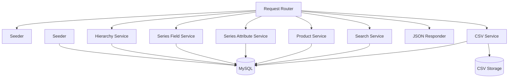
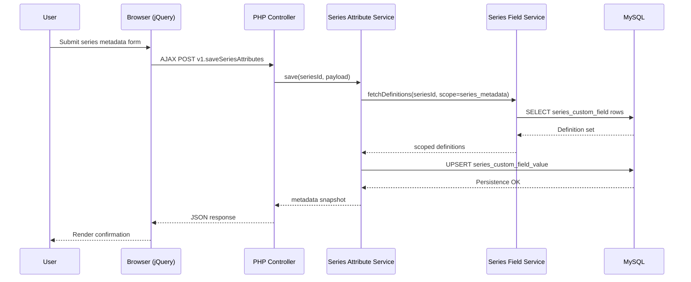
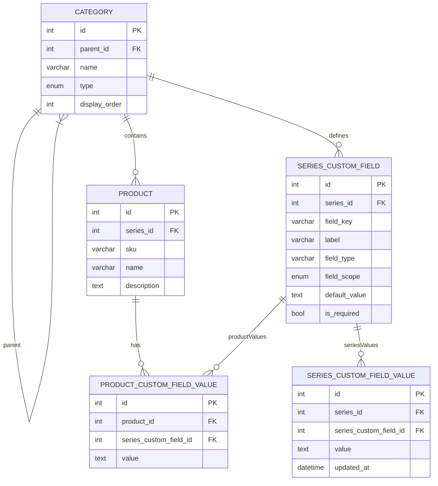
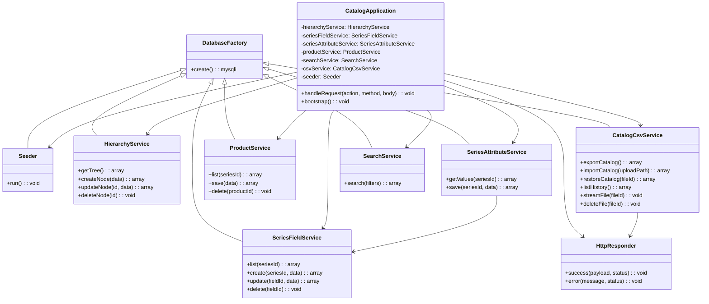
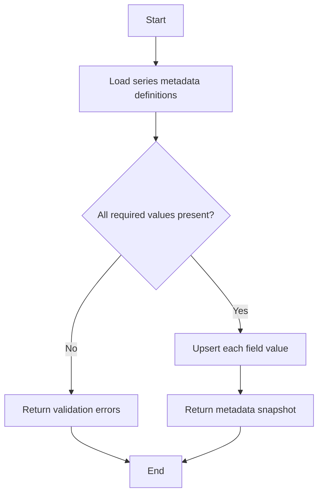
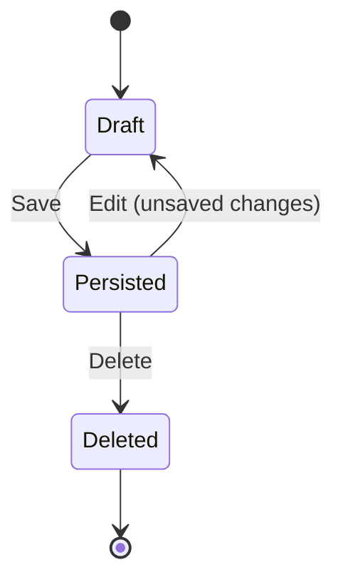

# Product Catalog Management Specification

## 1. Architecture and Technology Choices

- **Stack**: PHP 8.x, MySQL 8.x, jQuery (minimal DOM handling), HTML5 with a lightweight CSS file served from `/assets/css`.
- **Rationale**: PHP offers native MySQLi support for direct DB connections; jQuery simplifies dynamic form handling without heavy frontend frameworks; separating static assets into `/assets` keeps HTML lean while remaining framework-light.
- **Constraints**: Single PHP entry point; MySQL credentials stored in dedicated config; avoid external services due to restricted environment; host custom CSS/JS under `/assets` while continuing to load vendor libraries (jQuery) from a stable CDN.
- **Structure**: Backend refactored to PHP OOP with discrete classes (`CatalogApplication`, `HttpResponder`, `DatabaseFactory`, `Seeder`, `HierarchyService`, `SeriesFieldService`, `SeriesAttributeService`, `ProductService`, `SearchService`, `CatalogCsvService`, `PublicCatalogService`) to isolate responsibilities and enhance maintainability; `SeriesFieldService` now focuses on field metadata while `SeriesAttributeService` persists series-level values, and `PublicCatalogService` composes data from every domain into a single immutable snapshot.
- **Asset Storage**: CSV import/export history persisted under `storage/csv` using timestamped filenames to enable download or deletion without extra schema.
- **Trade-offs**: Using a single PHP file centralizes logic but increases complexity-mitigated via modular PHP functions; MySQLi over PDO for simplicity but lacks driver abstraction.

## 2. Data Model

### Tables
- `category` (`id`, `parent_id`, `name`, `type`, `display_order`, timestamps) - stores hierarchy nodes (`category`, `series`).
- `product` (`id`, `series_id`, `sku`, `name`, `description`, timestamps) - product catalog entries.
- `series_custom_field` (`id`, `series_id`, `field_key`, `label`, `field_type`, `field_scope`, `default_value`, `sort_order`, `is_required`) - shared definition table where `field_scope` is either `series_metadata` or `product_attribute`.
- `series_custom_field_value` (`id`, `series_id`, `series_custom_field_id`, `value`, timestamps) - stores the actual metadata values for a series when `field_scope = series_metadata`.
- `product_custom_field_value` (`id`, `product_id`, `series_custom_field_id`, `value`) - stores product attribute data referencing definitions where `field_scope = product_attribute`.
- `seed_migration` (`id`, `name`, `executed_at`) - prevents reseeding.

### Relationships
- A category can have child categories or series.
- A series is a category node with `type = 'series'`.
- Products belong to a series.
- Custom field definitions belong to a series and are filtered by scope; `series_metadata` definitions hydrate `series_custom_field_value` rows, whereas `product_attribute` definitions validate `product_custom_field_value`.

## 3. Key Processes

1. **Initial Seeding**: On first run, seed predefined hierarchy, series, and both series-metadata and product-attribute field definitions.
2. **Hierarchy Management**: CRUD operations for categories and series (create, rename, delete with safeguards).
3. **Series Metadata Field Management**: Add/remove/update series-level custom field definitions that describe the series entity through a dedicated metadata-only form colocated with the metadata editor so new definitions are no longer limited to the seeded trio.
4. **Series Metadata Value Management**: Load/edit/persist values for series-level fields through `SeriesAttributeService`.
5. **Product Attribute Field Management**: Maintain product-level dynamic fields per series (scope `product_attribute`) to keep product schema flexible.
6. **Product Management**: Create/edit/delete products while validating dynamic attributes via product field definitions.
7. **Search Aggregation**: Provide unified querying across categories, series, products, expose both field scopes for advanced filters, and allow series metadata to influence ranking.
8. **HTTP Request Dispatch**: `CatalogApplication::handleRequest` delegates `action` parameters to service collaborators via controller methods, enforces HTTP verbs, and builds JSON responses through `HttpResponder`.
9. **Rendering**: Standalone `catalog_ui.html` hosts HTML layout while loading `catalog_ui.js` from `/assets/js` and `catalog_ui.css` from `/assets/css` for behavior and styling.
10. **Validation & Persistence**: Server-side validation mirrors both field scopes to keep API behavior deterministic for AJAX operations.
11. **Frontend Interaction**: Single HTML page renders hierarchy pane, detail pane, metadata editor, product grid, and search filters while relying on jQuery AJAX calls; the metadata pane now ships with its own field-definition form (scope locked to `series_metadata`) so administrators can add unlimited metadata inputs without leaving the section.
12. **CSV Import/Export Lifecycle**: `CatalogCsvService` reads/writes the stakeholder-supplied schema (`category_path`, `product_name`, `acf.*` product attribute columns), derives the series name from the last `category_path` segment, maps `product_name` to both SKU and display label, synchronizes only product-attribute fields, and persists timestamped history entries for upload/download/delete/restore actions.
13. **Series Context Isolation**: Every async request that hydrates series-specific state (fields, metadata definitions/values) gates its response by the currently selected series ID so background responses from previously selected nodes are ignored, preventing metadata "bleed" across series.
14. **Public Catalog Snapshot**: `PublicCatalogService` aggregates categories, series, metadata definitions/values, product custom field labels, and product data into one JSON payload exposed via a GET-only action for publishing/consumption use cases.

## 4. Pseudocode (Critical Paths)

### Seed Operation
```text
if not seed_migration contains 'initial_catalog':
    Seeder::beginTransaction()
    Seeder::insertHierarchy()
    Seeder::insertSeriesFields(scope='series_metadata')
    Seeder::insertSeriesFields(scope='product_attribute')
    Seeder::recordSeedCompletion()
    Seeder::commit()
```

### Save Product
```text
ProductService::save(request):
    validate required params (series_id, sku, name)
    fields = SeriesFieldService::listForSeries(series_id, scope='product_attribute')
    validate custom field inputs against fields
    begin transaction
    if product_id provided:
        repository::updateProduct()
    else:
        repository::createProduct()
    repository::syncCustomFieldValues()
    commit and return success response with updated product payload
```

### Save Series Metadata
```text
SeriesAttributeService::save(seriesId, payload):
    definitions = SeriesFieldService::listForSeries(seriesId, scope='series_metadata')
    validate payload keys exist in definitions and honor required flags
    begin transaction
    foreach definition in definitions:
        value = payload[definition.fieldKey] ?? null
        repository::persistSeriesValue(seriesId, definition.id, value)
    commit and return merged definitions + values snapshot
```

### Search Catalog
```text
SearchService::search(query, filters):
    normalizedQuery = trim(lowercase(query))
    results = { categories: [], series: [], products: [], seriesMeta: [], productFieldMeta: [] }
    if normalizedQuery not empty:
        results.categories = repository::searchCategories(normalizedQuery)
        results.series = repository::searchSeries(normalizedQuery)
        results.products = repository::searchProducts(normalizedQuery)
    if filters.seriesId provided:
        productMeta = SeriesFieldService::listForSeries(seriesId, scope='product_attribute')
        seriesMeta = SeriesAttributeService::getValues(seriesId)
        foreach filter value provided:
            apply filter clause against product_custom_field_value
        results.products = repository::searchFilteredProducts(seriesId, filters)
        results.productFieldMeta = productMeta
        results.seriesMeta = seriesMeta
    return limited results ordered by relevance
```

### Frontend Interaction Loop
```text
on document ready:
    fetch hierarchy via GET v1.listHierarchy (API base: catalog.php)
    render nested lists and bind click handlers

on node select:
    populate detail panel
    if node type is series:
        fetch series metadata definitions + values (scope series_metadata)
        ignore responses if selected node changes before data arrives
        render metadata form and metadata field editor
        fetch product field definitions + products
        render product grid with dynamic inputs

on metadata field form submit:
    scope = series_metadata (locked)
    post v1.saveSeriesField payload (create/update)
    refresh metadata definitions + values and keep editors in sync

on metadata value form submit:
    collect inputs mapped by field key
    post v1.saveSeriesAttributes
    refresh metadata snapshot on success

on product/custom field/node form submit:
    serialize inputs to JSON
    call corresponding POST action
    refresh relevant pane on success
    surface validation errors inline on failure

search panel interactions:
    when series selected in filters, fetch v1.listSeriesFields for metadata
    submit combined query + filters to v1.searchCatalog
    render grouped results (categories, series, products) with context actions
```

### Export Catalog CSV
```text
CatalogCsvService::exportCatalog():
    ensure storage/csv directory exists
    categories = repository::fetchAllCategories()
    products = repository::fetchProductsWithSeries()
    attributeKeys = fetch product_attribute field keys ordered by sort_order (preserving header order from latest import)
    filename = timestamp + '_export.csv'
    open CSV writer in storage path
    write header: ['category_path', 'product_name'] + attributeKeys (e.g., 'acf.length', 'acf.measure_result_0_frequency', ...)
    foreach product:
        categoryPath = buildCategoryPath(categories, product.series_id, include series name as last segment)
        productLabel = product.sku if sku not empty else product.name
        row = [
            categoryPath,
            productLabel,
        ]
        foreach fieldKey in attributeKeys:
            row[] = product.customValues[fieldKey] ?? ''
        write row
    close file and return metadata (fileId, downloadName, size, timestamp)
```

### Import Catalog CSV / Restore Stored CSV
```text
CatalogCsvService::importCatalog(uploadPath):
    ensure storage/csv directory exists
    store copy of uploaded file with timestamp prefix
    return processCsvFile(storedPath, fileId, originalName)

CatalogCsvService::restoreCatalog(fileId):
    ensure storage/csv directory exists
    validate fileId matches YYYYMMDDHHMMSS_(export|import) pattern
    locate file under storage/csv and ensure readability
    return processCsvFile(existingPath, fileId, deriveOriginalName(fileId))

CatalogCsvService::processCsvFile(path, fileId, originalName):
    read CSV header; expect column[0] = category_path, column[1] = product_name
    attributeColumns = header columns starting at index 2; preserve header text verbatim as product field_key
    begin transaction
    touchedProducts = touchedSeries = touchedCategories = empty sets
    foreach row in CSV:
        if row is empty -> continue
        categorySegments = split(row.category_path, '>'), trim whitespace, drop empty segments
        require >= 2 segments (first categories, last series)
        seriesName = last segment
        parentId = null
        foreach segment in categorySegments except last:
            parentId = upsertCategory(parentId, segment, touchedCategories)
        seriesId = upsertSeries(parentId, seriesName, display_order = 0, touchedSeries)
        ensure product_attribute field definitions exist per attribute column:
            label = derive label from header (title case)
            create definition if missing with scope=product_attribute and sort_order = column index - 2
        skuAndName = trim(row.product_name)
        productId = upsertProduct(seriesId, skuAndName, skuAndName, description = null)
        customValues = foreach attribute column -> trimmed value
        persist product_attribute values for product
        touchedProducts += productId
    prune products/series/categories not referenced
    commit transaction and return counts + fileId metadata
```

## CSV File Format & Storage

- **Location**: All exported/imported CSV files are stored under `storage/csv` with filenames `YYYYMMDDHHMMSS_<type>[_original].csv` (type is `export` or `import`).
- **History**: Files remain until deleted via UI/API; metadata is inferred from filename and filesystem attributes (timestamp, size).
- **Columns**:
  - `category_path` - hierarchical categories separated by `>`; final segment is treated as the series node name while preceding segments map to nested categories.
  - `product_name` - single text field that maps to both SKU and display label (the same string is persisted to `product.sku` and `product.name`).
  - `<attribute headers>` - every remaining column represents a product attribute keyed exactly by the header text (`acf.length`, `acf.width`, `acf.measure_result_0_frequency`, etc.). Headers are stored verbatim as `series_custom_field.field_key` entries (scope `product_attribute`), and sort order follows the column order from the CSV to preserve the sample schema layout.
- **Import Semantics**: Each row upserts categories, derives the series from the last path segment, creates product-attribute definitions for any unseen attribute headers, inserts/updates a product using the shared `product_name` value for both SKU and label, synchronizes attribute values, and prunes orphaned hierarchy nodes not touched by the CSV.
- **Export Semantics**: Full catalog exported back into the same schema—`category_path`, `product_name`, and the ordered list of attribute headers aggregated from all product_attribute definitions. No series metadata columns are emitted.
- **Download/Delete/Restore**: API actions expose file list with timestamp and size, plus endpoints to stream, delete, or restore any stored CSV (restore re-runs the import pipeline against the stored file bytes).

## Deployment Artifacts

- `catalog.php` - PHP backend serving v1 API actions; returns JSON only.
- `catalog_ui.html` - Static HTML client consuming the API and referencing local assets.
- `assets/css/catalog_ui.css` - Styling for the management UI (layout, tables, status messaging).
- `assets/js/catalog_ui.js` - jQuery-based interaction layer for AJAX-driven management workflows.
- `scripts/run-tests.ps1` - PowerShell harness for automated test execution.

### Load Hierarchy
```text
function getHierarchy():
    query categories ordered by type, display_order
    iterate and build nested array keyed by parent_id
    return JSON structure to jQuery for rendering tree UI
```

## 5. System Context Diagram

```mermaid
graph TD
    User[Catalog Manager] -->|HTTP (AJAX)| PHPApp[PHP Catalog Page]
    PHPApp -->|MySQLi| MySQLDB[(MySQL Database)]
    PHPApp -->|Configuration| ConfigFile[db_config.php]
```

## 6. Container/Deployment Overview

```mermaid
graph LR
    subgraph Workstation
        Browser[Web Browser]
    end
    subgraph Server
        PHPFpm[PHP Runtime (Single Page)]
        MySQLDB[(MySQL 8)]
    end
    Browser --> PHPFpm
    PHPFpm --> MySQLDB
```

## 7. Module Relationship Diagram



## 8. Sequence Diagram (Product Save)



## 9. ER Diagram



## 10. Class Diagram (Backend Services)



## 11. Flowchart (Hierarchy Node Creation)



## 12. State Diagram (Product Lifecycle)



## Test Approach Overview

- **Unit Tests**: PHP unit tests for service functions (SeriesFieldService validation, SeriesAttributeService upsert logic, ProductService save flows).
- **Integration Tests**: Database seeding plus CRUD operations across hierarchy, series metadata, product attributes against a test database snapshot.
- **End-to-End**: Manual verification of series metadata editing + product CRUD flows through the single-page UI using seeded data.
- **Tooling**: `scripts/run-tests.ps1` orchestrates seed verification, metadata/product regression tests, and backend smoke coverage (PowerShell).

## Open Questions & Decisions

- **Decided**: Series-specific fields seeded initially (per user) with explicit field scope for metadata vs product attributes.
- **Decided**: Single page supports management for hierarchy and products.
- **Decided**: No authentication, plain text fields only, supports create and edit.
- **Pending**: None at this time.


### Public Catalog Snapshot
```text
PublicCatalogService::buildSnapshot():
    hierarchy = HierarchyService::listHierarchy().hierarchy
    seriesIds = collect series node ids from hierarchy
    productFields = SeriesFieldService::fetchFieldsForSeriesIds(seriesIds, scope=product_attribute)
    seriesMetaDefs = SeriesFieldService::fetchFieldsForSeriesIds(seriesIds, scope=series_metadata)
    seriesMetaValues = SeriesAttributeService::fetchMetadataPayloads(seriesIds)
    products = ProductService::fetchProductsForSeriesIds(seriesIds)
    foreach seriesId in seriesIds:
        snapshot.seriesMap[seriesId] = {
            metadataDefinitions = seriesMetaDefs[seriesId] ?? [],
            metadataValues = seriesMetaValues[seriesId]['values'] ?? {},
            productFields = productFields[seriesId] ?? [],
            products = products[seriesId] ?? []
        }
    embed snapshot.seriesMap data into hierarchy nodes typed 'series'
    return {
        generatedAt: now(),
        hierarchy: hierarchyWithSeriesData
    }
```
