# Product Catalog Management Specification

## 1. Architecture and Technology Choices

- **Stack**: PHP 8.x, MySQL 8.x, jQuery (minimal DOM handling), HTML5 with Bootstrap 5.3 layered beneath the bespoke stylesheet served from `/assets/css`.
- **Rationale**: PHP offers native MySQLi support for direct DB connections; jQuery simplifies dynamic form handling without heavy frontend frameworks; separating static assets into `/assets` keeps HTML lean while remaining framework-light.
- **Constraints**: Single PHP entry point; MySQL credentials stored in dedicated config; avoid external services due to restricted environment; host custom CSS/JS under `/assets` while continuing to load vendor libraries (jQuery) from a stable CDN.
- **Structure**: Backend refactored to PHP OOP with discrete classes (`CatalogApplication`, `HttpResponder`, `DatabaseFactory`, `Seeder`, `HierarchyService`, `SeriesFieldService`, `SeriesAttributeService`, `ProductService`, `CatalogCsvService`, `CatalogTruncateService`, `PublicCatalogService`, `SpecSearchService`) to isolate responsibilities and enhance maintainability; `SeriesFieldService` now focuses on field metadata while `SeriesAttributeService` persists series-level values, `CatalogTruncateService` performs destructive resets with confirmation/audit logging, `PublicCatalogService` composes data from every domain into a single immutable snapshot, and `SpecSearchService` orchestrates the new `/api/spec-search/*` endpoints (root categories, grouped product categories, facets, and product searches) with placeholders that developers can replace with real WooCommerce + ACF queries. The frontend is now a single ES6 module (`CatalogUI`) that wraps all jQuery interactions with cached selectors, arrow-function helpers, and batched render/update pipelines to minimize DOM reflow and repeated AJAX calls. Section 2 contains two fully independent editors: the Series Custom Fields card renders a Product Attribute Field Editor that always posts `fieldScope = product_attribute`, while the Series Metadata card owns both the Series Metadata Field Editor (`fieldScope = series_metadata`) and the values form so scopes never mingle.
- **UI Layout & Bootstrap Integration**: `catalog_ui.html` now loads Bootstrap 5.3 (CSS + bundle JS) from the official CDN strictly for its grid/flex utilities, reset rules, tables, and buttons, while `/assets/css/catalog_ui.css` remains the source of truth for spacing, typography, and colors. Bootstrap gutters (`g-*`), margins, and paddings are overridden via explicit `gap`, `margin`, and `padding` declarations plus `.no-bootstrap-gap` helpers so every horizontal/vertical rhythm (8px gutters inside cards, 16px between panels, 24px section spacing) matches the pre-Bootstrap layout. Bootstrap classes are applied conservatively (e.g., `container-fluid`, `row`, `col`) to reuse its responsive helpers without altering panel widths, and any new components must document their spacing overrides inside the stylesheet to guarantee visual parity.
- **UI Table Controls (Bootstrap DataTables)**: jQuery DataTables 1.13.x with the Bootstrap 5 styling bundle is the canonical table enhancer for admin lists. Each interactive table (`#series-fields-table`, `#series-metadata-fields-table`, `#product-list-table`, `#csv-history-table`, `#truncate-audit-table`) instantiates DataTables in client-side mode with paging, column sorting, and per-table search while reusing the cached row data that already lives inside `CatalogUI`. The plugin is loaded via CDN alongside Bootstrap, and all initialization/destruction logic runs through the ES6 module so rerenders, selection states, and button bindings remain centralized. Layout conventions are locked: the "Show _N_ entries" length selector must appear on the top-left, the search box on the top-right, the pagination controls on the bottom-right, and the range/status text on the bottom-left so every table presents identical controls across the app. The Products grid (`#product-list-table`) additionally enables DataTables FixedColumns (left = 3) with horizontal scrolling so the ID/SKU/Name columns stay pinned while custom attribute columns can extend beyond the viewport.
- **Spec Search Experience**: `spec-search.html` is a read-only standalone HTML5 page that mirrors the stakeholder-provided wireframe for the public-facing catalog search. The UI now flows through three stacked sections (Root/Product Category selection, Mechanical Parameter facets, and a DataTables-powered result grid) and every interaction talks to dedicated JSON endpoints (`/api/spec-search/root-categories`, `/api/spec-search/product-categories`, `/api/spec-search/facets`, `/api/spec-search/products`) instead of a monolithic snapshot. Root category radios (General vs Automotive) refresh the grouped product category checkbox deck and clear downstream facets/results; category checkboxes feed the Mechanical Parameters panel, which renders horizontally scrollable facet cards (Series + arbitrary ACF fields) with their own in-panel filter inputs and vertically scrollable value lists. Selecting any facet chips builds a filter object that the frontend posts to `/api/spec-search/products`, and the response hydrates the DataTable (search box + pagination) where each row includes an Edit CTA that links to `catalog.php?sku=<value>`. Base markup remains readable without JavaScript, but progressive enhancement layers DataTables/search interactivity when scripts are available; QA can still demo offline by adding `data-demo="true"` to `<main>` to opt into the embedded sample payload.
- **Asset Storage**: CSV import/export history persisted under `storage/csv` using timestamped filenames to enable download or deletion without extra schema, and destructive truncate events are appended as JSON lines under `storage/csv/truncate_audit.jsonl` so operators can verify who initiated the wipe and what counts were affected.
- **Trade-offs**: Using a single PHP file centralizes logic but increases complexity-mitigated via modular PHP functions; MySQLi over PDO for simplicity but lacks driver abstraction.

## 2. Data Model

### Tables
- `category` (`id`, `parent_id`, `name`, `type`, `display_order`, timestamps) - stores hierarchy nodes (`category`, `series`).
- `product` (`id`, `series_id`, `sku`, `name`, `description`, timestamps) - product catalog entries.
- `series_custom_field` (`id`, `series_id`, `field_key`, `label`, `field_type`, `field_scope`, `default_value`, `sort_order`, `is_required`) - shared definition table where `field_scope` is either `series_metadata` or `product_attribute`.
- `series_custom_field_value` (`id`, `series_id`, `series_custom_field_id`, `value`, timestamps) - stores the actual metadata values for a series when `field_scope = series_metadata`.
- `product_custom_field_value` (`id`, `product_id`, `series_custom_field_id`, `value`) - stores product attribute data referencing definitions where `field_scope = product_attribute`.
- `seed_migration` (`id`, `name`, `executed_at`) - prevents reseeding.

### Relationships
- A category can have child categories or series.
- A series is a category node with `type = 'series'`.
- Products belong to a series.
- Custom field definitions belong to a series and are filtered by scope; `series_metadata` definitions hydrate `series_custom_field_value` rows, whereas `product_attribute` definitions validate `product_custom_field_value`.

### Spec Search Projection
- `SpecSearchRootCategory` (GET `/api/spec-search/root-categories`) - array of `{ id, name, default }` describing the mutually exclusive funnels exposed as radios in Section 1 (General Product default true).
- `SpecSearchCategoryGroup` (GET `/api/spec-search/product-categories?root_id=...`) - array of `{ group, categories[] }` where each category is `{ id, name }`. Groups map to headings such as EMC Components, Magnetic Components, Transformer, Wireless Power Transfer, etc., and categories render as multiselect checkboxes.
- `SpecSearchFacetDefinition` (POST `/api/spec-search/facets`) - array of `{ key, label, allowMulti: true, values[] }` representing the Mechanical Parameter cards for Series and ACF-backed attributes (Inductance, Current Rating, Core Size, ...). `values` contains `{ label, value }` items, and each card includes its own local search placeholder string so Section 2 can filter client-side while the server remains authoritative over the available chips.
- `SpecSearchResultRow` (POST `/api/spec-search/products`) - normalized entries shaped as `{ sku, series, attributes: { [facetKey]: value } }` so DataTables can render Series plus every facet column dynamically; each row also yields `editUrl = "catalog.php?sku=<sku>"`.
- `SpecSearchFilterState` (client-side only) - tracks the selected root ID, checked product category IDs, per-facet search queries (client-side filter inputs), and selected facet values. This state object becomes the POST body for `/api/spec-search/facets` (without `filters`) and `/api/spec-search/products` (with `filters`), keeping the server authoritative while still allowing quick UI clears when upstream selections change.

## 3. Key Processes

1. **Initial Seeding**: On first run, seed predefined hierarchy, series, and both series-metadata and product-attribute field definitions.
2. **Hierarchy Management**: CRUD operations for categories and series (create, rename, delete with safeguards).
3. **Series Metadata Field Management**: Add/remove/update series-level custom field definitions that describe the series entity through a dedicated metadata-only form colocated with the metadata editor so new definitions are no longer limited to the seeded trio; the metadata editor never reuses the Product Attribute Field Editor controls, so scope stays locked to `series_metadata`.
4. **Series Metadata Value Management**: Load/edit/persist values for series-level fields through `SeriesAttributeService`.
5. **Product Attribute Field Management**: Maintain product-level dynamic fields per series (scope `product_attribute`) to keep product schema flexible; the Product Attribute Field Editor lives exclusively within the Series Custom Fields card, hides the scope dropdown entirely, and always submits `fieldScope = product_attribute` to prevent cross-scope edits.
6. **Product Management**: Create/edit/delete products while validating dynamic attributes via product field definitions.
7. **HTTP Request Dispatch**: `CatalogApplication::handleRequest` delegates `action` parameters to service collaborators via controller methods, enforces HTTP verbs, and builds JSON responses through `HttpResponder`.
8. **Rendering**: Standalone `catalog_ui.html` hosts HTML layout while loading `catalog_ui.js` from `/assets/js` and `catalog_ui.css` from `/assets/css` for behavior and styling.
9. **Validation & Persistence**: Server-side validation mirrors both field scopes to keep API behavior deterministic for AJAX operations.
10. **Frontend Interaction**: Single HTML page renders hierarchy pane, detail pane, metadata editor, CSV tooling, and product grid while relying on a thin jQuery layer; the Series Custom Fields card contains a Product Attribute Field Editor that never renders a scope dropdown (hard-coded to `product_attribute`), the metadata pane ships with its own field-definition form (scope locked to `series_metadata`) so administrators can add unlimited metadata inputs without leaving the section, the Products panel stacks the product list table above the edit form so each occupies the full horizontal width for readability, and the CSV Import/Export/Truncate tools are contained inside the same `panel` component as the other sections to preserve visual consistency when Bootstrap utilities are applied.
11. **Frontend Module Architecture**: `assets/js/catalog_ui.js` exposes a single `CatalogUI` ES6 module that initializes once, caches frequently used DOM nodes, memoizes hierarchy/series lookups, batches AJAX promises with `Promise.all`, and uses arrow functions/template literals to keep rendering lean. All UI updates flow through dedicated `render*` helpers so layout thrashing is minimized.
12. **CSV Import/Export Lifecycle**: `CatalogCsvService` reads/writes the stakeholder-supplied schema (`category_path`, `product_name`, `acf.*` product attribute columns), derives the series name from the last `category_path` segment, maps `product_name` to both SKU and display label, synchronizes only product-attribute fields, and persists timestamped history entries for upload/download/delete/restore actions.
13. **Series Context Isolation**: Every async request that hydrates series-specific state (fields, metadata definitions/values) gates its response by the currently selected series ID so background responses from previously selected nodes are ignored, preventing metadata "bleed" across series.
14. **Public Catalog Snapshot**: `PublicCatalogService` aggregates categories, series, metadata definitions/values, product custom field labels, and product data into one JSON payload exposed via a GET-only action for publishing/consumption use cases.
15. **Catalog Truncate Workflow**: `CatalogTruncateService` performs a full catalog reset initiated from the CSV tools card, enforces a two-step confirmation in the UI, suspends concurrent CSV import/export calls, disables foreign key checks, truncates every catalog-related table (category, series, products, field definitions, field values, and seed history), leaves the database empty so the next CSV import defines the entire hierarchy, and records an immutable audit entry under `storage/csv/truncate_audit.jsonl` with timestamp, operator-provided reason, and deletion counts.
16. **Bootstrap DataTables UX**: All administrator-facing tables (`#series-fields-table`, `#series-metadata-fields-table`, `#product-list-table`, `#csv-history-table`, `#truncate-audit-table`) are enhanced with jQuery DataTables (Bootstrap 5 skin) in client-side mode so users gain pagination, column sorting, and inline search without changing the cached state flow inside `CatalogUI`; each render helper now (re)hydrates the DataTable instance after diffing rows so selection state and button hooks stay intact.
17. **Spec Search Rendering**: `spec-search.html` now follows the stakeholder's three-section funnel with separate API calls for each stage. On load the UI requests `/api/spec-search/root-categories`, renders the "Filter Product By" radios (General Product default), and immediately fetches `/api/spec-search/product-categories?root_id=<value>` for the grouped checkbox deck. Any root change clears Section 2 (Mechanical Parameters) and Section 3 (results) before loading the newly scoped product categories. Selecting categories triggers paired POST operations: `/api/spec-search/facets` returns the Series/ACF cards that should render horizontally with their own search inputs, and `/api/spec-search/products` hydrates the DataTable even before any facet chips are active. Picking/deselecting facet values re-posts the filter envelope so the backend remains authoritative over which products stay visible. Emptying either the category or facet selections reverts the table to the relevant upstream scope, and the Edit column links each SKU to `catalog.php?sku=<value>` for quick handoff to the admin UI.
18. **Spec Search API Composition**: `SpecSearchService` now exposes four controller actions—`GET /api/spec-search/root-categories`, `GET /api/spec-search/product-categories`, `POST /api/spec-search/facets`, `POST /api/spec-search/products`—instead of returning a single snapshot. Each endpoint currently emits deterministic PHP arrays so the UI stays functional without WooCommerce, and every response includes comments describing how to swap in the real WooCommerce + ACF queries. Facet payloads identify each card's key and available values, while the products response already flattens Series, SKU, and the requested ACF columns to keep the frontend stateless.

## Spec Search Layout Blueprint

- **Product Search Band**: Full-width bordered container titled "Product Search" with the "Filter Product By" label followed by root category radios (General Product prechecked, Automotive Product unchecked). Selecting a root deselects the other radio, triggers `GET /api/spec-search/product-categories?root_id=<value>`, clears Sections 2-3, and re-renders the grouped checkbox deck before any further filtering is allowed.
- **Product Category Deck**: Stacked directly beneath the root row. Categories are grouped under headings (EMC Components, Magnetic Components, Transformer, Wireless Power Transfer). Each heading owns a column of checkboxes (Ferrite Chip Bead, Ferrite Chip Bead (Large Current), Chip Inductor, etc.). Multiple checkboxes may be active, vertical overflow is handled per column to maintain tidy gutters, and any change posts `{ root_id, category_ids[] }` to `/api/spec-search/facets` plus `/api/spec-search/products`.
- **Mechanical Parameters**: Section title "Mechanical Parameters" matches the wireframe. Facet cards (Series + each returned ACF field) render horizontally and support x-overflow so the row can scroll if more cards exist than available viewport width. Each card contains a "Search Filter" input scoped to that card plus a y-scrollable checklist of values (e.g., ZIK300-RC-10, 2.2µH, 10A). Cards visually match in width/spacing while remaining responsive.
- **Multi-Facet Interaction**: Cards behave independently. Selecting/deselecting values builds `filters.series` or `filters[facetKey]` arrays and triggers `/api/spec-search/products`. Clearing all values within a card simply removes that facet from the filter payload while retaining upstream selections.
- **Results Grid**: Lower panel uses DataTables with the built-in search box on the top-right, standard pagination on the bottom-right, and a Series column followed by one column per facet (Inductance, Current, Core Size, etc.). The final column houses an `Edit` button linking to `catalog.php?sku=<value>`. Table width expands to accommodate numerous columns with horizontal scroll if needed, and rows retain consistent gutters relative to the sections above.
- **Accessibility**: Every radio, checkbox, and facet item has a `<label>` for click targets, focus outlines remain visible, and section headings use ARIA landmarks where helpful. Overflow cues (horizontal scroll indicator arrows) and the root/category instructions now live inside inline helper text so screen readers can understand the funnel order.

## 4. Pseudocode (Critical Paths)

### Seed Operation
```text
if not seed_migration contains 'initial_catalog':
    Seeder::beginTransaction()
    Seeder::insertHierarchy()
    Seeder::insertSeriesFields(scope='series_metadata')
    Seeder::insertSeriesFields(scope='product_attribute')
    Seeder::recordSeedCompletion()
    Seeder::commit()
```

### Save Product
```text
ProductService::save(request):
    validate required params (series_id, sku, name)
    fields = SeriesFieldService::listForSeries(series_id, scope='product_attribute')
    validate custom field inputs against fields
    begin transaction
    if product_id provided:
        repository::updateProduct()
    else:
        repository::createProduct()
    repository::syncCustomFieldValues()
    commit and return success response with updated product payload
```

### Save Series Metadata
```text
SeriesAttributeService::save(seriesId, payload):
    definitions = SeriesFieldService::listForSeries(seriesId, scope='series_metadata')
    validate payload keys exist in definitions and honor required flags
    begin transaction
    foreach definition in definitions:
        value = payload[definition.fieldKey] ?? null
        repository::persistSeriesValue(seriesId, definition.id, value)
    commit and return merged definitions + values snapshot
```

### Save Series Field Definition
```text
SeriesFieldService::save(seriesId, payload):
    expectedScope = payload.fieldScope (controller defaults this per editor: product_attribute vs series_metadata)
    assert expectedScope in ['series_metadata', 'product_attribute']
    if payload.id provided:
        existing = repository::getSeriesFieldById(payload.id)
        assert existing and existing.series_id == seriesId
        assert existing.field_scope == expectedScope // prevents cross-scope editing
    validate: field_key unique per (series_id, expectedScope), label required, sort_order integer, field_type supported
    begin transaction
        repository::upsertSeriesField(seriesId, expectedScope, payload)
    commit
    return list(seriesId, expectedScope)
```

### Truncate Catalog
```text
CatalogTruncateService::truncateCatalog(reason, correlationId):
    assert reason provided and <= 256 chars
    ensure no CSV import/export job currently running
    capture deleted counts (categories vs series vs products vs fields vs values)
    begin transaction
        disable foreign_key_checks
        truncate tables: product_custom_field_value, series_custom_field_value, product, series_custom_field, category, seed_migration
        re-enable foreign_key_checks
    commit
    auditEntry = {
        id: correlationId,
        event: 'catalog_truncate',
        reason,
        deleted: {
            categories: deletedCategories,
            products: deletedProducts,
            fieldDefinitions: deletedFields,
            productValues: deletedProductValues,
            seriesValues: deletedSeriesValues
        },
        timestamp: nowIso8601
    }
    append auditEntry as JSON line to storage/csv/truncate_audit.jsonl
    return auditEntry
```

### Frontend Interaction Loop
```text
on document ready:
    render Section 1 cards inline (Hierarchy tree with per-category accordions that default to expanded for root (level 0) only, Add Node form, Update Node form, Selected Node details)
    fetch hierarchy via GET v1.listHierarchy (API base: catalog.php)
    populate node index + bind click handlers

on node select:
    update Selected Node card
    if node type is series:
        reveal Section 2 + Section 3
        fetch series fields (product + metadata), metadata values, and products in parallel
        ignore responses if series selection changes before data arrives

on series field form submit/delete (Product Attribute Field Editor):
    post v1.saveSeriesField or v1.deleteSeriesField with fieldScope hardcoded to product_attribute
    refresh only the Series Custom Fields card (Section 2 column 1) and rerender product form inputs

on metadata field/value submit (Series Metadata Field Editor + Values form):
    post v1.saveSeriesField (scope = series_metadata) or v1.saveSeriesAttributes
    rerender the Series Metadata card (Section 2 column 2) with updated definitions + inline value inputs

on product form/delete submit:
    post v1.saveProduct or v1.deleteProduct
    refresh the Products section (full-width list table stacked above the full-width form) while keeping cached state for the active series

on CSV actions:
    post v1.exportCsv (stream file), post multipart v1.importCsv, post v1.restoreCsv, post v1.deleteCsv
    refresh history/audit tables after each action, disable controls while truncate lock is active

on truncate:
    show modal (requires TRUNCATE + reason) -> post v1.truncateCatalog
    display audit id toast, reset Section 1 selection + hide Sections 2-3 until a series is chosen again
```

### Table Rendering & DataTables Lifecycle
```text
ensureDataTable(tableId, rows, columns):
    if dataTableRegistry contains tableId:
        instance = dataTableRegistry[tableId]
        instance.clear()
        instance.rows.add(rows) // keep same row object references for click handlers
        instance.draw(false) // retain current pagination state
    else:
        instance = $(tableId).DataTable({
            data: rows,
            columns: columns,
            paging: true,
            searching: true,
            ordering: true,
            lengthChange: false,
            responsive: false,
            dom: '<"row"<"col-sm-6"f><"col-sm-6"l>>t<"row"<"col-sm-6"i><"col-sm-6"p>>',
            language: bootstrap5TableCopy
        })
        dataTableRegistry[tableId] = instance

teardownDataTable(tableId):
    if dataTableRegistry contains tableId:
        dataTableRegistry[tableId].destroy()
        delete dataTableRegistry[tableId]

// Product grid specifics
renderProductList():
    columns = ['ID','SKU','Name', dynamic attribute headers..., 'Actions']
    rows = cachedProducts map -> { custom: values }
    ensureDataTable(
        '#product-list-table',
        rows,
        columns,
        options = {
            pageLength: 10,
            extraOptions: {
                scrollX: true,
                scrollCollapse: true,
                fixedColumns: { left: 3 }
            }
        }
    )
```

### Spec Search Data Hydration
`spec-search.html` now orchestrates multiple lightweight endpoints rather than depending on a monolithic snapshot. `SpecSearchService` exposes four public methods (`listRootCategories`, `listProductCategories`, `listFacets`, `searchProducts`) that proxy WooCommerce categories/products + ACF metadata but currently return deterministic mock data until the production bridge is wired up. The UI keeps only transient state (selected root/categories/facet values) and always rehydrates downstream panels from the server.

- **Root Categories (`GET /api/spec-search/root-categories`)**: returns the mutually exclusive radios for Section 1. The response also indicates which root should be preselected (`default: true`) so the UI can immediately load its categories.
- **Product Categories (`GET /api/spec-search/product-categories?root_id=...`)**: grouped checkbox headings describing product families. Whenever the root changes the UI clears all category, facet, and results state before calling this endpoint.
- **Mechanical Facets (`POST /api/spec-search/facets`)**: accepts `{ root_id, category_ids[] }` and returns the cards to display in Section 2. Each card lists its label, key, and value options so the frontend simply renders them; when category selections change the UI calls this endpoint again and clears any per-card selections.
- **Products (`POST /api/spec-search/products`)**: takes the full filter envelope `{ root_id, category_ids, filters: { series: [], <facetKey>: [] } }` and returns the result rows for Section 3, including every facet column needed by the DataTable plus the catalog edit URL.

```text
SpecSearch.init():
    render loading skeletons for Sections 1-3
    loadRootCategories()

loadRootCategories():
    fetch('/api/spec-search/root-categories')
        .then(set state.rootCategories + default selection)
        .then(rootId => {
            state.activeRootId = rootId
            renderRootRadios()
            return loadProductCategories()
        })
        .catch(show offline alert + keep demo payload option visible)

handleRootChange(rootId):
    state.activeRootId = rootId
    clear state.categoryIds, state.facetSelections, state.facetSearch, DataTable rows
    show empty states for Sections 2-3
    loadProductCategories()

loadProductCategories():
    fetch(`/api/spec-search/product-categories?root_id=${state.activeRootId}`)
        .then(render grouped checkboxes)
        .then(clear Section 2 + 3 panels until categories picked)

handleCategoryToggle(categoryId):
    toggle categoryId in state.categoryIds
    if state.categoryIds empty:
        clear facets + table
        return
    loadFacets()
    loadProducts() // ensures table updates with category filtering even before facet chips selected

loadFacets():
    post('/api/spec-search/facets', { root_id: state.activeRootId, category_ids: [...state.categoryIds] })
        .then(render facet cards with per-card search inputs, horizontal scroll container)
        .then(() => { state.facetSelections = {}; state.facetSearch = {} })

loadProducts():
    post('/api/spec-search/products', {
        root_id: state.activeRootId,
        category_ids: [...state.categoryIds],
        filters: buildFacetFilterPayload(state.facetSelections)
    })
        .then(rows => ensureDataTable('#spec-search-results', rows, specSearchColumns, { pageLength: 10 }))

handleFacetSearchInput(facetKey, query):
    state.facetSearch[facetKey] = query
    filter facet value list client-side (does not refetch)

handleFacetValueToggle(facetKey, value):
    toggle value inside state.facetSelections[facetKey]
    loadProducts()
```

### Export Catalog CSV
```text
CatalogCsvService::exportCatalog():
    ensure storage/csv directory exists
    categories = repository::fetchAllCategories()
    products = repository::fetchProductsWithSeries()
    attributeKeys = fetch product_attribute field keys ordered by sort_order (preserving header order from latest import)
    filename = timestamp + '_export.csv'
    open CSV writer in storage path
    write header: ['category_path', 'product_name'] + attributeKeys (e.g., 'acf.length', 'acf.measure_result_0_frequency', ...)
    foreach product:
        categoryPath = buildCategoryPath(categories, product.series_id, include series name as last segment)
        productLabel = product.sku if sku not empty else product.name
        row = [
            categoryPath,
            productLabel,
        ]
        foreach fieldKey in attributeKeys:
            row[] = product.customValues[fieldKey] ?? ''
        write row
    close file and return metadata (fileId, downloadName, size, timestamp)
```

### Import Catalog CSV / Restore Stored CSV
```text
CatalogCsvService::importCatalog(uploadPath):
    ensure storage/csv directory exists
    store copy of uploaded file with timestamp prefix
    return processCsvFile(storedPath, fileId, originalName)

CatalogCsvService::restoreCatalog(fileId):
    ensure storage/csv directory exists
    validate fileId matches YYYYMMDDHHMMSS_(export|import) pattern
    locate file under storage/csv and ensure readability
    return processCsvFile(existingPath, fileId, deriveOriginalName(fileId))

CatalogCsvService::processCsvFile(path, fileId, originalName):
    read CSV header; expect column[0] = category_path, column[1] = product_name
    attributeColumns = header columns starting at index 2; preserve header text verbatim as product field_key
    begin transaction
    touchedProducts = touchedSeries = touchedCategories = empty sets
    foreach row in CSV:
        if row is empty -> continue
        categorySegments = split(row.category_path, '>'), trim whitespace, drop empty segments
        require >= 2 segments (first categories, last series)
        seriesName = last segment
        parentId = null
        foreach segment in categorySegments except last:
            parentId = upsertCategory(parentId, segment, touchedCategories)
        seriesId = upsertSeries(parentId, seriesName, display_order = 0, touchedSeries)
        ensure product_attribute field definitions exist per attribute column:
            label = derive label from header (title case)
            create definition if missing with scope=product_attribute and sort_order = column index - 2
        skuAndName = trim(row.product_name)
        productId = upsertProduct(seriesId, skuAndName, skuAndName, description = null)
        customValues = foreach attribute column -> trimmed value
        persist product_attribute values for product
        touchedProducts += productId
    prune products/series/categories not referenced
    commit transaction and return counts + fileId metadata
```

## CSV File Format & Storage

- **Location**: All exported/imported CSV files are stored under `storage/csv` with filenames `YYYYMMDDHHMMSS_<type>[_original].csv` (type is `export` or `import`).
- **History**: Files remain until deleted via UI/API; metadata is inferred from filename and filesystem attributes (timestamp, size).
- **Columns**:
  - `category_path` - hierarchical categories separated by `>`; final segment is treated as the series node name while preceding segments map to nested categories.
  - `product_name` - single text field that maps to both SKU and display label (the same string is persisted to `product.sku` and `product.name`).
  - `<attribute headers>` - every remaining column represents a product attribute keyed exactly by the header text (`acf.length`, `acf.width`, `acf.measure_result_0_frequency`, etc.). Headers are stored verbatim as `series_custom_field.field_key` entries (scope `product_attribute`), and sort order follows the column order from the CSV to preserve the sample schema layout.
- **Import Semantics**: Each row upserts categories, derives the series from the last path segment, creates product-attribute definitions for any unseen attribute headers, inserts/updates a product using the shared `product_name` value for both SKU and label, synchronizes attribute values, and prunes orphaned hierarchy nodes not touched by the CSV.
- **Export Semantics**: Full catalog exported back into the same schema—`category_path`, `product_name`, and the ordered list of attribute headers aggregated from all product_attribute definitions. No series metadata columns are emitted.
- **Download/Delete/Restore**: API actions expose file list with timestamp and size, plus endpoints to stream, delete, or restore any stored CSV (restore re-runs the import pipeline against the stored file bytes).

## Catalog Truncate Workflow

- **Trigger Surface**: The CSV tools panel receives a dedicated `Truncate Catalog` danger-button positioned beside Import/Export. Clicking the button opens a modal that reiterates the destructive scope and requires the operator to type `TRUNCATE` plus a free-form reason before enabling the confirm action.
- **Backend Action**: The UI POSTs to `v1.truncateCatalog` with `reason`, `correlationId` (GUID from the browser), and `confirmToken` (always `TRUNCATE`). The controller routes to `CatalogTruncateService`, which acquires a short-lived advisory lock so CSV import/export and restore actions cannot run concurrently.
- **Deletion Order**: Within a transaction the service disables foreign key checks, truncates `product_custom_field_value`, `series_custom_field_value`, `product`, `series_custom_field`, `category`, and `seed_migration`, then reenables the checks. No baseline data is reseeded; the database remains empty (aside from auto-increment resets) until the next CSV import repopulates it.
- **Audit & Logging**: Every truncate writes a JSON object to `storage/csv/truncate_audit.jsonl` capturing the correlation ID, provided reason, deleted row counts, and precise timestamps. The response echoes the same data so the UI can show a toast containing the audit identifier.
- **History Surfacing**: `v1.listCsvHistory` returns `audits` (latest truncate entries) and `truncateInProgress` so the UI can present the audit table and disable CSV controls whenever the advisory lock is held.
- **Post-Action UX**: The modal closes only after the API responds successfully, the CSV history list refreshes (so operators can immediately start a new import), and the new audit entry appears in the UI table for transparency.

## Deployment Artifacts

- `catalog.php` - PHP backend serving v1 API actions; returns JSON only.
- `catalog_ui.html` - Static HTML client consuming the API and referencing local assets.
- `assets/css/catalog_ui.css` - Styling for the management UI (layout, tables, status messaging).
- `assets/js/catalog_ui.js` - jQuery-based interaction layer for AJAX-driven management workflows.
- `scripts/run-tests.ps1` - PowerShell harness for automated test execution.

### Load Hierarchy
```text
function getHierarchy():
    query categories ordered by type, display_order
    iterate and build nested array keyed by parent_id
    return JSON structure to jQuery for rendering tree UI
```

## 5. System Context Diagram

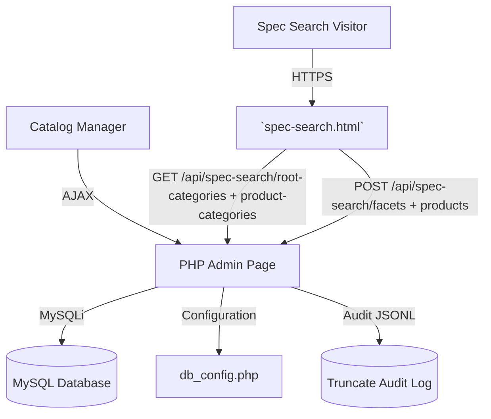

## 6. Container/Deployment Overview

```mermaid
graph LR
    subgraph Workstation
        Browser[Web Browser]
    end
    subgraph Server
        WebRoot[Apache/Nginx Static Host]
        PHPFpm[PHP Runtime (Admin SPA)]
        MySQLDB[(MySQL 8)]
        AuditFile[(storage/csv/truncate_audit.jsonl)]
    end
    Browser -->|/catalog_ui.html| PHPFpm
    Browser -->|/spec-search.html + assets| WebRoot
    WebRoot --> PHPFpm
    PHPFpm --> MySQLDB
    PHPFpm --> AuditFile
```

## 7. Module Relationship Diagram

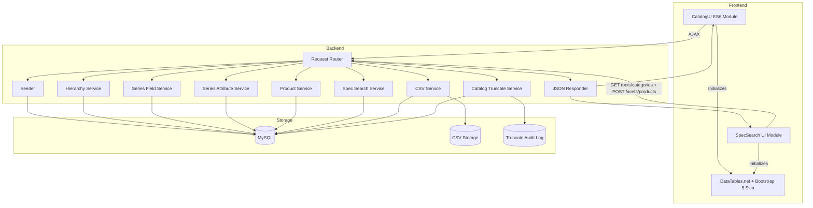

## 8. Sequence Diagram (Field Editor Isolation)

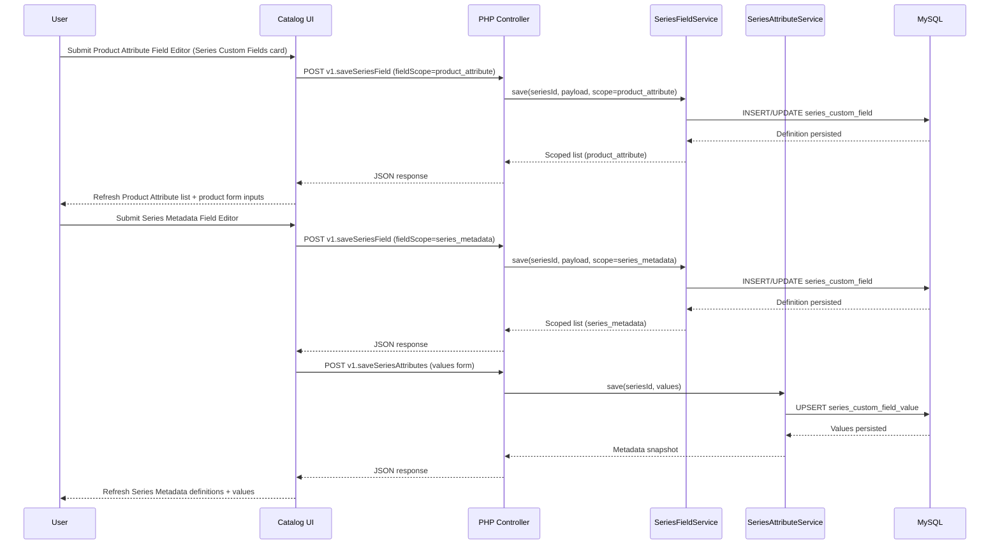

## 8b. Sequence Diagram (Catalog Truncate)

```mermaid
sequenceDiagram
    participant U as User
    participant B as Browser (CSV Tools)
    participant P as PHP Controller
    participant CTS as CatalogTruncateService
    participant D as MySQL
    participant A as Audit Log
    U->>B: Click "Truncate Catalog"
    B->>U: Show modal + require TRUNCATE + reason
    U->>B: Provide confirmation text
    B->>P: POST v1.truncateCatalog(reason, correlationId)
    P->>CTS: truncateCatalog(command)
    CTS->>D: BEGIN; disable FK + TRUNCATE tables
    D-->>CTS: Row counts
    CTS->>A: append audit entry
    CTS-->>P: deletion counts + audit id
    P-->>B: JSON success payload
    B-->>U: Toast showing audit id + prompt to import CSV
```

## 8c. Sequence Diagram (Spec Search Filtering)

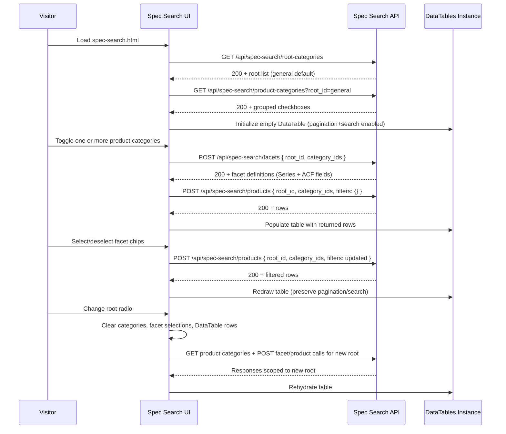

## 9. ER Diagram

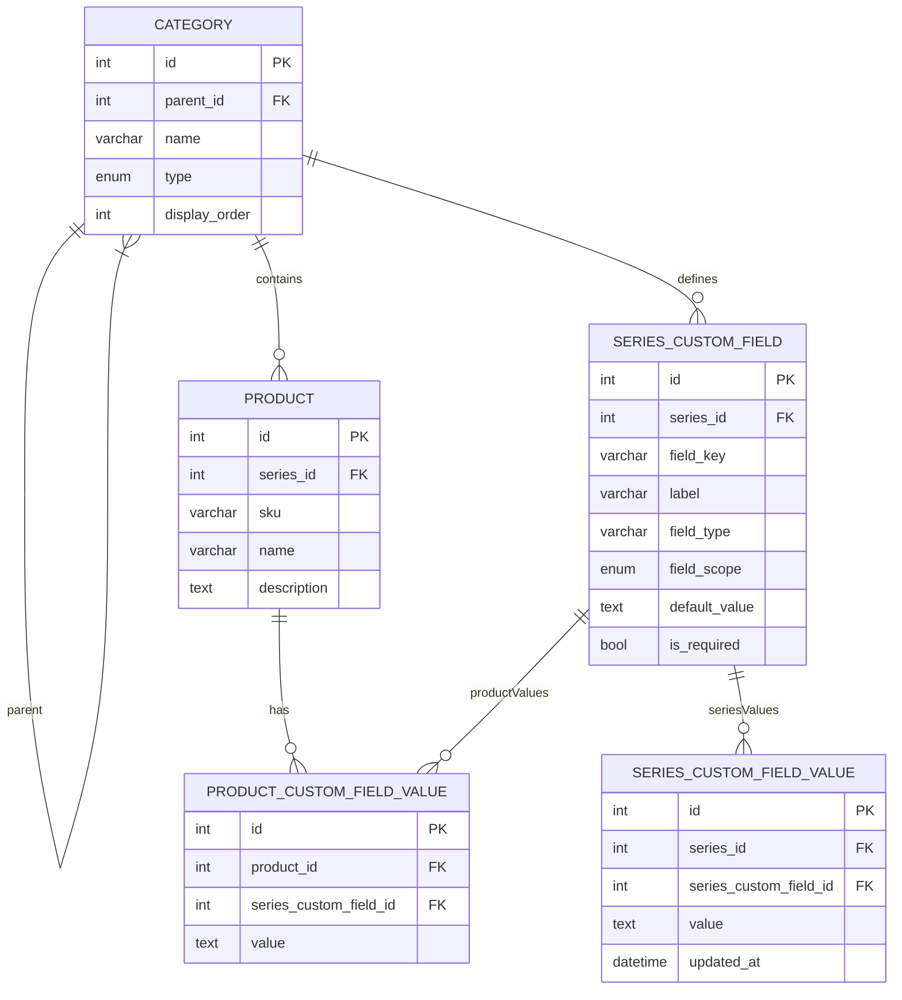

## 10. Class Diagram (Backend Services)

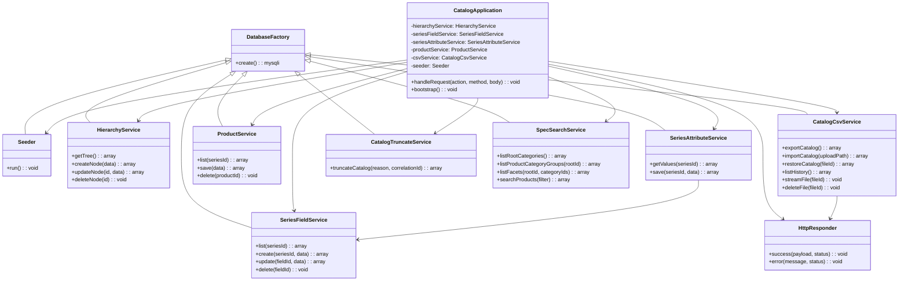

## 11. Flowchart (Catalog Truncate)

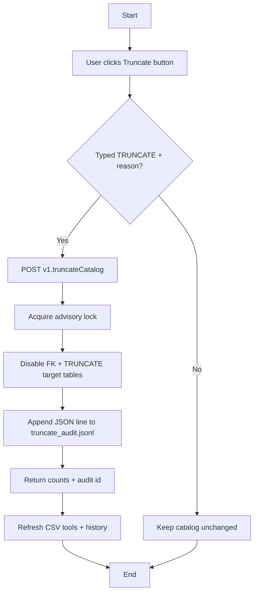

### Flowchart (Spec Search Interaction)

```mermaid
flowchart LR
    Load[Visitor loads spec-search.html] --> FetchRoots[GET /api/spec-search/root-categories]
    FetchRoots --> RenderRoots[Render radios + default selection]
    RenderRoots --> FetchCats[GET /api/spec-search/product-categories?root_id=active]
    FetchCats --> Idle[Await user input]
    Idle --> RootToggle{Root changed?}
    RootToggle -->|Yes| Reset[Clear categories/facets/results]
    Reset --> FetchCats
    RootToggle -->|No| Idle
    Idle --> CategoryToggle[Toggle product category checkbox]
    CategoryToggle --> HasSel{Any categories selected?}
    HasSel -->|No| ClearPanels[Empty facets + DataTable]
    ClearPanels --> Idle
    HasSel -->|Yes| LoadFacets[POST /api/spec-search/facets]
    LoadFacets --> LoadProducts[POST /api/spec-search/products (filters = category only)]
    LoadProducts --> IdleFacets[Await facet input]
    IdleFacets --> FacetChange[Facet value search/toggle]
    FacetChange --> LoadFiltered[POST /api/spec-search/products (filters include facets)]
    LoadFiltered --> IdleFacets
```

## 12. State Diagram (Product Lifecycle)

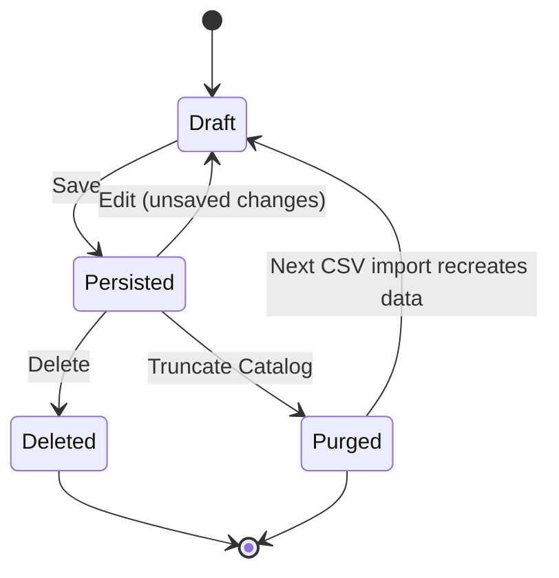

## Test Approach Overview

- **Unit Tests**: PHP unit tests for service functions (SeriesFieldService validation, SeriesAttributeService upsert logic, ProductService save flows).
- **Integration Tests**: Database seeding plus CRUD operations across hierarchy, series metadata, product attributes against a test database snapshot.
- **End-to-End**: Manual verification of series metadata editing + product CRUD flows through the single-page UI using seeded data.
- **Tooling**: `scripts/run-tests.ps1` orchestrates seed verification, metadata/product regression tests, and backend smoke coverage (PowerShell).

## Open Questions & Decisions

- **Decided**: Series-specific fields seeded initially (per user) with explicit field scope for metadata vs product attributes.
- **Decided**: Single page supports management for hierarchy and products.
- **Decided**: No authentication, plain text fields only, supports create and edit.
- **Pending**: None at this time.


### Public Catalog Snapshot
```text
PublicCatalogService::buildSnapshot():
    hierarchy = HierarchyService::listHierarchy().hierarchy
    seriesIds = collect series node ids from hierarchy
    productFields = SeriesFieldService::fetchFieldsForSeriesIds(seriesIds, scope=product_attribute)
    seriesMetaDefs = SeriesFieldService::fetchFieldsForSeriesIds(seriesIds, scope=series_metadata)
    seriesMetaValues = SeriesAttributeService::fetchMetadataPayloads(seriesIds)
    products = ProductService::fetchProductsForSeriesIds(seriesIds)
    foreach seriesId in seriesIds:
        snapshot.seriesMap[seriesId] = {
            metadataDefinitions = seriesMetaDefs[seriesId] ?? [],
            metadataValues = seriesMetaValues[seriesId]['values'] ?? {},
            productFields = productFields[seriesId] ?? [],
            products = products[seriesId] ?? []
        }
    embed snapshot.seriesMap data into hierarchy nodes typed 'series'
    return {
        generatedAt: now(),
        hierarchy: hierarchyWithSeriesData
    }
```

## LaTeX Template Management Module

### 1. Architecture and Technology Choices
- **Stack Reuse**: Extends the existing PHP 8/MySQL backend (`catalog.php`) so all CRUD routes piggyback on the same dispatcher, HTTP responder, and MySQL connection pool. Client remains static HTML with jQuery helpers and Bootstrap 5 utilities, mirroring `catalog_ui.html` conventions.
- **New Services**: Introduces `LatexTemplateService` for persistence/validation and `LatexBuildService` for MiKTeX orchestration. Services live alongside existing ones so seeding, routing, and testing remain centralized.
- **MiKTeX Integration**: Uses `pdflatex` from MiKTeX via `proc_open` with a configurable binary path, capturing stdout/stderr for surfacing readable error messages. Generated PDFs are saved beneath `storage/latex-pdfs` with timestamp-based filenames to avoid collisions.
- **Frontend Toolchain**: `latex-templating.html` loads Bootstrap 5, jQuery, DataTables, and MathJax via CDN (matching catalog UI versions) plus a dedicated ES6 module (`assets/js/latex-templating.js`). No build step is required.
- **Constraints/Trade-offs**: PHP renders JSON only, so the HTML page runs all UI logic client-side. MiKTeX compilation may take several seconds; requests use async AJAX with optimistic UI states. The live preview is MathJax-based, which approximates but cannot match 100% of `pdflatex` output—users rely on both preview and final PDF.

### 2. Data Model
- **Table `latex_template`**:
  - `id` INT PK auto-increment.
  - `title` VARCHAR(255) NOT NULL.
  - `description` TEXT NULL.
  - `latex_source` LONGTEXT NOT NULL.
  - `pdf_path` VARCHAR(512) NULL (relative path to generated PDF).
  - `created_at` / `updated_at` TIMESTAMP tracking lifecycle.
- **Filesystem**: PDFs stored under `storage/latex-pdfs/{id}-{timestamp}.pdf`; temporary `.tex` artifacts written to `storage/latex-build` or the OS temp directory.
- **API Shapes**: JSON payload mirrors table fields plus derived attributes (e.g., `previewUrl`, truncated description).

### 3. Key Processes
1. **List Templates**: UI hits `catalog.php?action=v1.listLatexTemplates`, receives rows, hydrates DataTable with paging/search/sort.
2. **Create/Update**: Form submission POSTs or PUTs JSON. Backend validates (`title`, `latex_source`), writes record, returns updated row. UI refreshes table and resets form state.
3. **Delete**: UI prompts, sends DELETE; backend removes DB row and deletes associated PDFs from disk.
4. **Build PDF**: UI POSTs to `/build`, backend persists latest `latex_source`, runs MiKTeX, stores PDF path, returns download URL. UI updates preview panel and optional `<iframe>` target.
5. **Live Preview**: Client-only MathJax rendering triggered via debounced textarea input; backend not involved.

### 4. Pseudocode (Critical Paths)
```text
saveTemplate(payload):
    assert payload.title && payload.latex
    if payload.id:
        row = repository.find(payload.id) or throw NOT_FOUND
        row.title = payload.title
        row.description = payload.description
        row.latex = payload.latex
        row.updated_at = now()
        repository.update(row)
    else:
        row = repository.insert({title, description, latex, created_at=now(), updated_at=now()})
    return row

buildTemplate(id):
    row = repository.find(id) or throw NOT_FOUND
    tmpTex = writeTempFile(row.latex)
    runResult = miktex.runPdflatex(tmpTex, outputDir)
    if !runResult.success:
        throw LatexBuildException(runResult.errors)
    pdfPath = movePdfToStorage(runResult.pdfFile, id)
    repository.updatePdfPath(id, pdfPath)
    return {pdfPath, updated_at = now()}

deleteTemplate(id):
    row = repository.find(id) or return (idempotent delete)
    deleteFilesMatching(row.pdf_path)
    repository.delete(id)
```

### 5. System Context Diagram (Mermaid)
```mermaid
graph LR
    AdminUser[Admin User] -->|AJAX CRUD + Build| LatexUI[latex-templating.html]
    LatexUI -->|JSON actions| CatalogPHP[catalog.php dispatcher]
    CatalogPHP -->|CRUD| MySQL[(MySQL: latex_template)]
    CatalogPHP -->|pdflatex invocation| MiKTeX[MiKTeX CLI]
    CatalogPHP -->|Store PDF| Storage[/storage/latex-pdfs]
    AdminUser -->|Downloads PDF| Storage
```

### 6. Container / Deployment Overview (Mermaid)
```mermaid
graph TD
    subgraph Browser
        Page[latex-templating.html]
        Module[latex-templating.js]
    end
    subgraph WebServer (PHP-FPM/Apache)
        Dispatcher[catalog.php]
        Services[LatexTemplateService + LatexBuildService]
    end
    subgraph Infrastructure
        DB[(MySQL)]
        PdfStore[/storage/latex-pdfs]
        Toolset[MiKTeX pdflatex.exe]
    end
    Page --> Module
    Module --> Dispatcher
    Dispatcher --> Services
    Services --> DB
    Services --> Toolset
    Services --> PdfStore
```

### 7. Module Relationship Diagram (Mermaid)
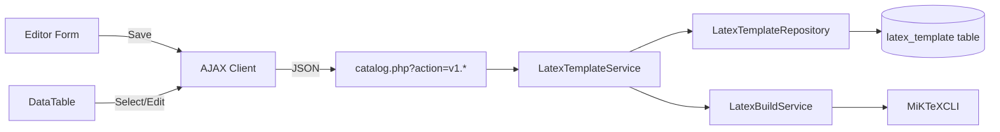

### 8. Sequence Diagram (Mermaid)
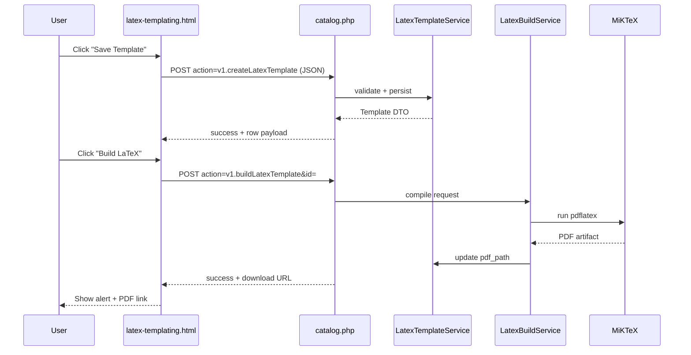

### 9. ER Diagram (Mermaid)
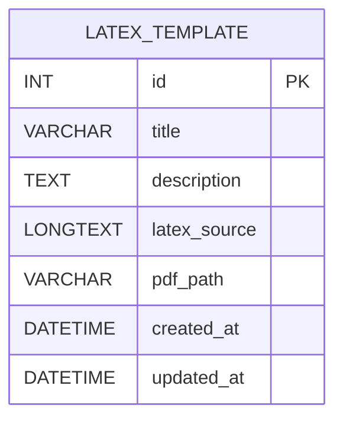

### 10. Class Diagram (Mermaid)
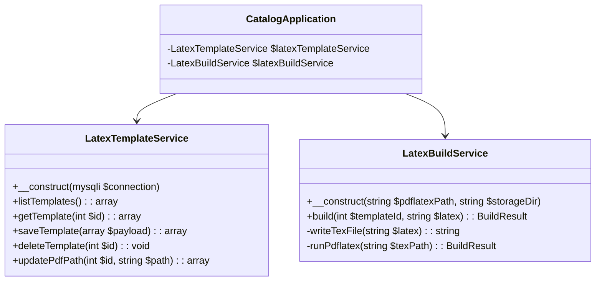

### 11. Flowchart (Mermaid)
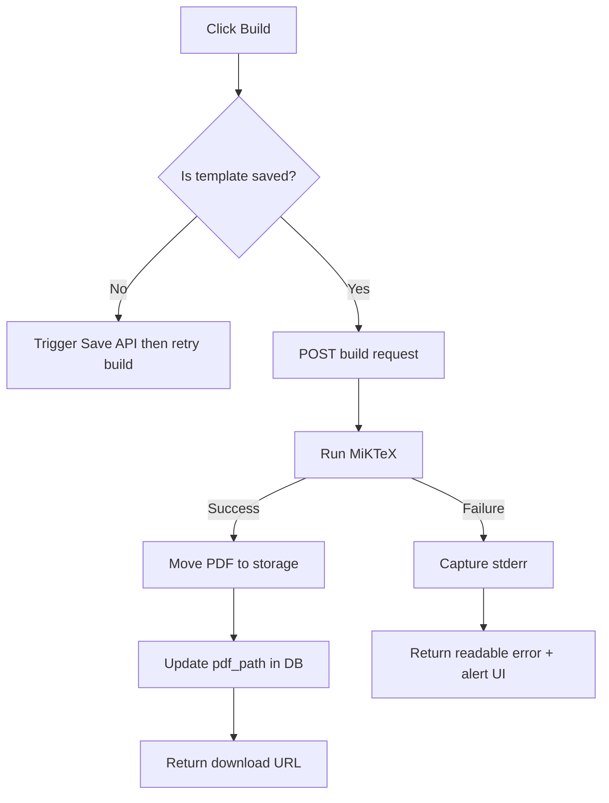

### 12. State Diagram (Mermaid)
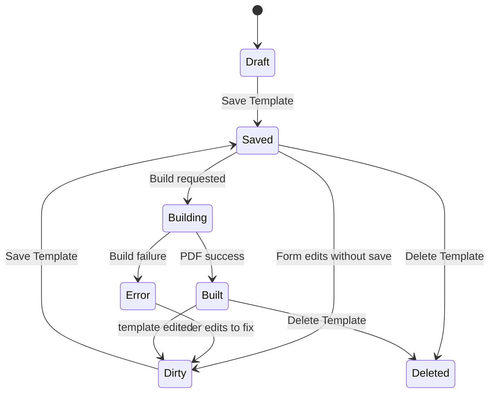
