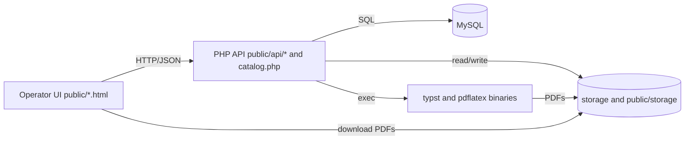
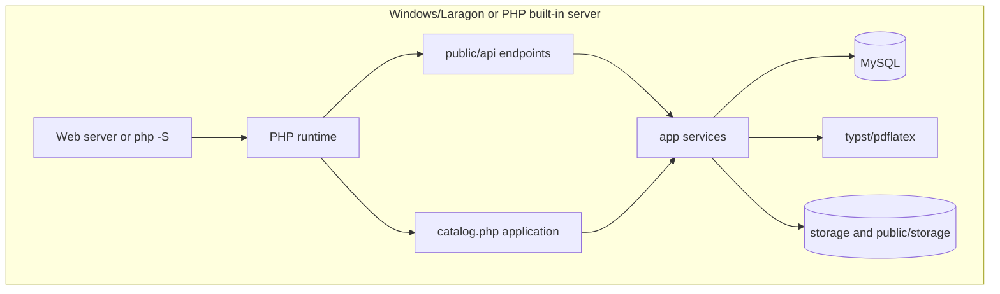
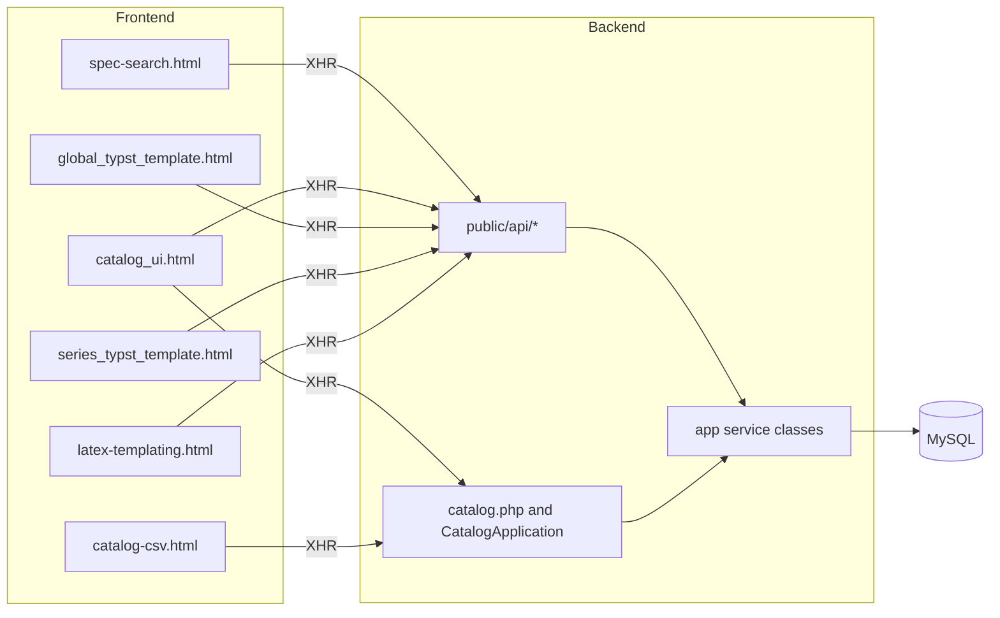
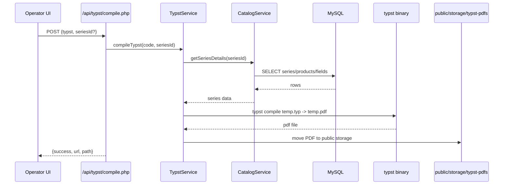
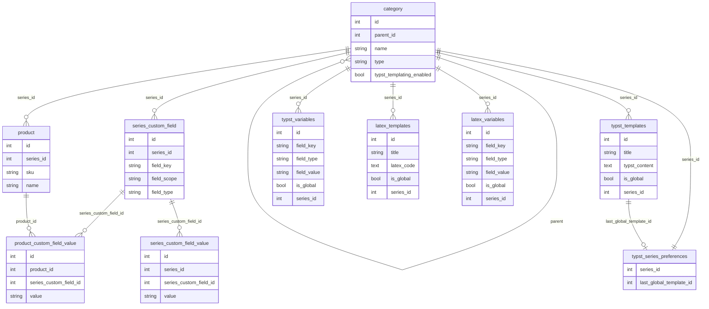
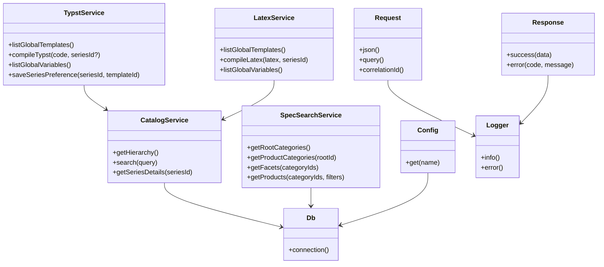
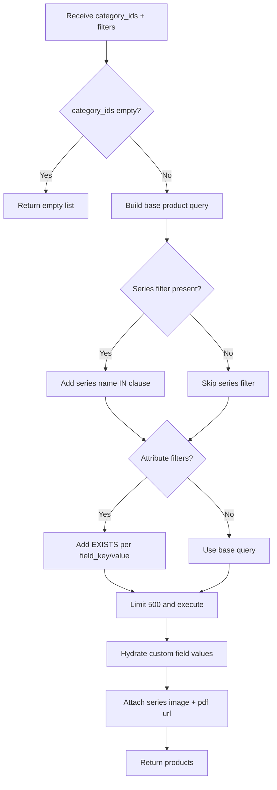
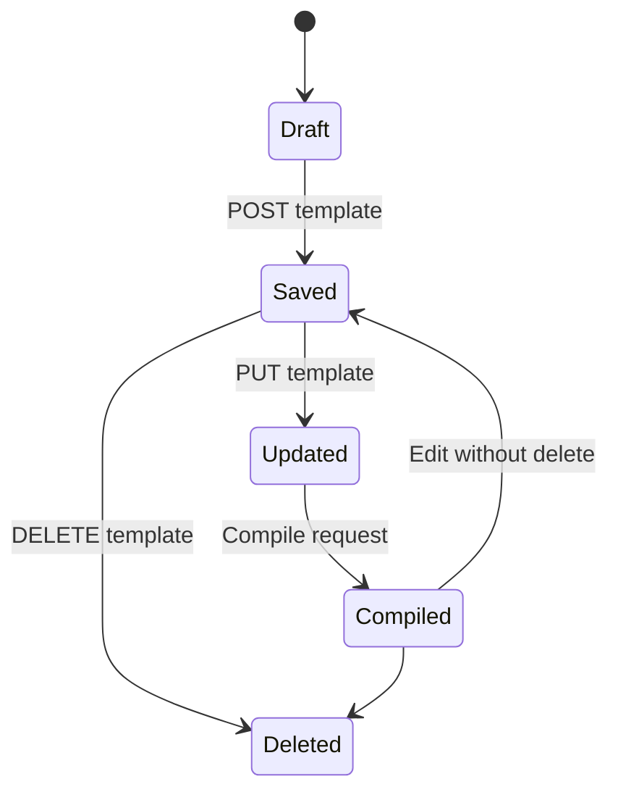

# Foundational Electronics Core Systems - Specification
**Version:** 2025-12-26  
**Repo:** Foundational-Electronics-Core-Systems  
**Primary stack:** PHP 8 (mysqli), MySQL, static HTML/JS, Typst/LaTeX  

## Assumptions & Open Questions
- Assumption: Operator UIs/APIs are protected by network or hosting controls; no auth/ACL layer is present in `public/api` or `catalog.php`.
- Open question: Which LaTeX schema is authoritative (`latex_template` in `catalog.php` vs `latex_templates`/`latex_variables` queried by `app/Latex`)? No migration file found.
- Open question: Is the `api/` directory still used alongside `public/api/`, or is it deprecated?
- Open question: Target production deployment topology is not defined (no Docker/IaC).
- Assumption: MySQL `product_catalog` plus filesystem storage under `storage/` and `public/storage/` are the only persistence layers.

## 1. Architecture and technology choices
### 1.1 Architecture overview
- Modular monolith: PHP endpoints under `public/api/` and `public/catalog.php` delegate to service classes in `app/` plus a legacy catalog module in `catalog.php`.
- Components: operator-facing static HTML/JS UIs, JSON API endpoints, service layer (Catalog/SpecSearch/Typst/LaTeX), MySQL database, filesystem storage, external PDF binaries.
- Trust boundaries: API executes SQL and shell commands (Typst/LaTeX), and writes to web-exposed `public/storage`; no authentication is implemented in code.

### 1.2 Technology choices (with rationale)
| Area | Choice | Evidence | Why this choice | Alternatives considered |
|---|---|---|---|---|
| Language/runtime | PHP 8 with strict_types | `app/Support/*.php`, `catalog.php` | Lightweight runtime and low operational overhead | Unknown/TBD |
| Data store | MySQL via mysqli | `config/db.php`, `app/Support/Db.php`, `catalog.php` | Simple relational model and direct SQL control | Unknown/TBD |
| API style | Scripted JSON endpoints + correlation IDs | `public/api/*`, `app/Support/Response.php` | Minimal framework, predictable payloads | Unknown/TBD |
| Service layer | Small service classes + catalog module | `app/Catalog/*`, `app/SpecSearch/*`, `app/Typst/*`, `catalog.php` | Keep domain logic centralized without full framework | Unknown/TBD |
| Frontend | Static HTML/JS UIs | `public/*.html`, `assets/` | No build pipeline; operator tooling is simple | Unknown/TBD |
| PDF tooling | `pdflatex` + `typst` binaries | `app/Latex/LatexService.php`, `app/Typst/TypstService.php`, `config/app.php` | External compilers for high-quality PDFs | Unknown/TBD |
| Logging | JSONL file logging with rotation | `app/Support/Logger.php`, `config/app.php` | Simple audit and troubleshooting trail | Unknown/TBD |
| Testing | Plain PHP tests + PowerShell runner | `tests/*.php`, `scripts/run-tests.ps1` | Fast smoke checks without framework | Unknown/TBD |

### 1.3 Non-functional requirements (NFRs)
- Performance: Spec search caps results at 500 and relies on indexed keys for predictable response time (`app/SpecSearch/SpecSearchService.php`, `catalog.php`).
- Availability: Single-node PHP + MySQL deployment is implied; no HA or background workers are defined.
- Security: Input validation and SQL escaping are used; destructive truncation requires a token and lock; logs avoid sensitive context (`catalog.php`, `app/Support/Logger.php`, `config/app.php`).
- Observability: Correlation IDs are emitted in responses; JSONL logs with rotation support request tracing (`app/Support/Response.php`, `app/Support/Logger.php`).
- Compliance/cost: Unknown/TBD (no policy or configuration in repo).

## 2. Data model
### 2.1 Conceptual model
- Catalog hierarchy: categories form a tree; series are a category type that owns products.
- Products: items within a series, keyed by SKU.
- Custom fields: definitions for series metadata and product attributes; values stored per series or per product.
- Templates: LaTeX and Typst templates (global or series-specific) that compile to PDFs.
- Variables: global or series-scoped variables used for templating (including file/image assets).
- Preferences: per-series UI preferences for last imported Typst global template.
- Files: CSV imports/exports, media uploads, and generated PDFs stored on disk and referenced by paths.

### 2.2 Logical model (tables/collections)
| Entity/Table | Primary key | Key fields | Relationships | Notes |
|---|---|---|---|---|
| category | id | parent_id, name, type, typst_templating_enabled, display_order | parent_id -> category.id; series -> product.series_id | Hierarchy of categories/series (`catalog.php`, `app/Catalog/CatalogService.php`). |
| product | id | series_id, sku, name, description | series_id -> category.id | Unique (series_id, sku) (`catalog.php`). |
| series_custom_field | id | series_id, field_key, label, field_type, field_scope, sort_order, is_required | series_id -> category.id | Defines metadata/attributes; unique per (series_id, field_scope, field_key) (`catalog.php`). |
| series_custom_field_value | id | series_id, series_custom_field_id, value | series_id -> category.id; series_custom_field_id -> series_custom_field.id | Stores series metadata values (`catalog.php`, `app/Catalog/CatalogService.php`). |
| product_custom_field_value | id | product_id, series_custom_field_id, value | product_id -> product.id; series_custom_field_id -> series_custom_field.id | Stores per-product attributes (`catalog.php`, `app/SpecSearch/SpecSearchService.php`). |
| typst_templates | id | title, typst_content, is_global, series_id, last_pdf_path, last_pdf_generated_at | series_id -> category.id | Auto-created by TypstService; stores last compiled PDF (`app/Typst/TypstService.php`). |
| typst_variables | id | field_key, field_type, field_value, is_global, series_id | series_id -> category.id | Global or scoped variables; file/image assets stored under `public/storage/typst-assets` (`app/Typst/TypstService.php`). |
| typst_series_preferences | series_id | last_global_template_id, updated_at | series_id -> category.id; last_global_template_id -> typst_templates.id | UI preference for series template import (`app/Typst/TypstService.php`). |
| latex_template | id | title, description, latex_source, pdf_path | (none) | Legacy LaTeX table created by `catalog.php`; scope unclear (`catalog.php`). |
| latex_templates | id | title, description, latex_code, is_global, series_id, last_pdf_path, last_pdf_generated_at | series_id -> category.id | Implied by `app/Latex/LatexService.php`; migration not found. |
| latex_variables | id | field_key, field_type, field_value, is_global, series_id | series_id -> category.id | Implied by `app/Latex/LatexService.php`; migration not found. |
| seed_migration | id | name, executed_at | (none) | Tracks seed runs (`catalog.php`). |

### 2.3 Data integrity & constraints
- Foreign keys enforce hierarchy and ownership (category -> category, product -> category, values -> fields/products) per schema in `catalog.php`.
- Uniqueness constraints: (series_id, sku) on product; (product_id, series_custom_field_id) and (series_id, series_custom_field_id) on value tables; (series_id, field_scope, field_key) on series_custom_field.
- Typst tables are created if missing at runtime to avoid migration failures (`app/Typst/TypstService.php`).
- File paths for PDFs/assets are stored as relative strings and normalized when returned (`app/SpecSearch/SpecSearchService.php`, `app/Typst/TypstService.php`).
- Truncate operations disable FK checks inside a transaction and record an audit entry in `storage/csv/truncate_audit.jsonl` (`catalog.php`).

## 3. Key processes
- **Catalog hierarchy and search**
  - Trigger: Operator opens Catalog UI or uses search.
  - Inputs: GET /api/catalog/hierarchy.php, GET /api/catalog/search.php?q=term.
  - Outputs: Tree of categories/series/products with counts and typst flag; flat search matches.
  - Key steps: ensure typst_templating_enabled column; query categories and products; attach products to series; build tree; for search, run LIKE queries on category/product.
  - Error cases: DB errors; empty query returns [].
  - Observability (logs/metrics/traces): request_start/request_success logging with correlationId in `public/api/catalog/*.php`.

- **Spec search facets and product filtering**
  - Trigger: Spec Search UI selects root categories, filters, or search.
  - Inputs: POST /api/spec-search/facets.php, POST /api/spec-search/products.php with category_ids and filters.
  - Outputs: Facet list + product list with dynamic attributes, seriesImage, pdfDownload.
  - Key steps: gather series under selected categories; compute facet values from custom fields and values; build SQL with series and attribute filters; limit 500; hydrate attributes; map series images and PDF URLs (Typst vs metadata).
  - Error cases: empty category_ids -> []; DB errors.
  - Observability (logs/metrics/traces): request_start/request_success logging with correlationId in `public/api/spec-search/*.php`.

- **Typst compile and PDF publishing**
  - Trigger: Operator clicks Compile or Save PDF in Typst UI.
  - Inputs: POST /api/typst/compile.php with typst code and optional seriesId; optional template save with lastPdfPath.
  - Outputs: PDF url/path; template metadata updated.
  - Key steps: ensure Typst tables exist; build data header with globals/series/products; sanitize keys; replace placeholders; stage assets; run typst binary; move PDF to public/storage/typst-pdfs; return url/path.
  - Error cases: missing seriesId, compile failure, missing binary, asset errors.
  - Observability (logs/metrics/traces): error responses with correlation IDs; debug output via PHP errors (no structured logger in Typst endpoints).

- **CSV import/export/restore**
  - Trigger: Operator uses Catalog CSV tools.
  - Inputs: CSV upload, export request, restore request with file id.
  - Outputs: Import summary (counts), export file id, history list.
  - Key steps: store files under storage/csv; parse categories/series/products/custom fields; upsert DB rows; export by rehydrating current catalog; restore by re-importing stored CSV; maintain history list.
  - Error cases: invalid file id, CSV parse errors, storage write failures.
  - Observability (logs/metrics/traces): API logs; history response includes audit entries and truncate lock status.

- **Catalog truncate with audit**
  - Trigger: Operator submits truncate request with confirmation token.
  - Inputs: reason, confirmToken (TRUNCATE), correlationId.
  - Outputs: deleted counts by table, auditId.
  - Key steps: validate reason length; verify token; acquire lock; collect counts; disable FK checks; truncate tables in transaction; write audit JSONL; release lock.
  - Error cases: token mismatch, lock held, DB errors, audit write failures.
  - Observability (logs/metrics/traces): API logs + storage/csv/truncate_audit.jsonl.

## 4. Pseudocode
```text
function GetCatalogHierarchy():
  ensureColumn(category, "typst_templating_enabled")
  categories = select * from category order by display_order, name
  products = select id, series_id, name, sku from product
  attach products to matching series nodes
  build tree by parent_id
  return tree

function SearchCatalog(query):
  term = trim(query)
  if term is empty:
    return []
  match categories where name like %term%
  match products where name or sku like %term%
  return merged matches

function GetSpecSearchProducts(categoryIds, filters):
  if categoryIds is empty:
    return []
  sql = base join on product, series, category
  if filters.series present:
    sql += series name IN (...)
  for each attribute filter:
    sql += EXISTS subquery on product_custom_field_value
  sql += LIMIT 500
  products = execute sql
  attrs = fetch attributes for product ids
  images/specs/typst = fetch series metadata + latest typst pdf
  merge attrs and media urls into products
  return products

function CompileTypst(code, seriesId):
  ensure typst tables exist
  buildDir = storage/typst-build
  data = build globals + series metadata + products
  safeData = sanitize keys for typst
  header = "#let data = ..." + aliases
  rendered = replace {{placeholders}} in code
  stage asset files into buildDir
  write header + rendered to temp.typ
  exec "typst compile" to temp.pdf
  if compile failed:
    raise error
  move pdf to public/storage/typst-pdfs
  return {url, path}

function ImportCatalogCsv(upload):
  validate upload and store under storage/csv
  parse rows
  for each row:
    ensure category path exists
    ensure series exists
    ensure product exists
    upsert custom field definitions and values
  return counts

function TruncateCatalog(payload):
  validate reason and confirmToken
  acquire lock
  counts = count rows by table
  begin transaction
  set FOREIGN_KEY_CHECKS = 0
  truncate tables
  set FOREIGN_KEY_CHECKS = 1
  commit
  write audit entry to storage/csv/truncate_audit.jsonl
  release lock
  return counts
```

## 5. System context diagram


## 6. Container/deployment overview


## 7. Module relationship diagram (Backend / Frontend)


## 8. Sequence diagram


## 9. ER diagram


## 10. Class diagram (key backend classes)


## 11. Flowchart


## 12. State diagram

